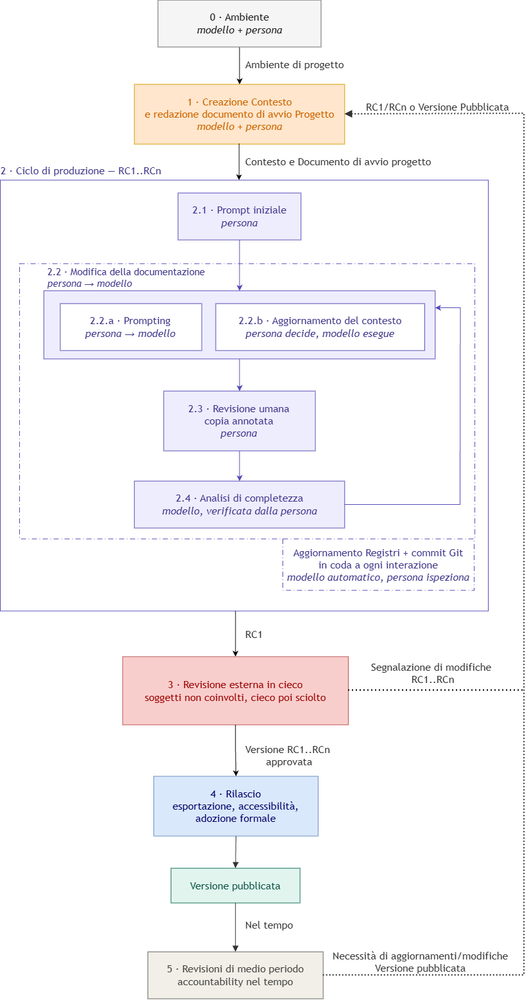

# Memento – Produzione e revisione documentale assistita da IA

### Specifica di metodo per amministrazioni pubbliche

*Il nome viene dal film omonimo in cui il protagonista non ricorda nulla di ciò che ha fatto e sopravvive grazie a ciò che ha scritto: è il principio su cui il metodo si regge.*

**Versione:** 4.2 – `27/08/2026`
**Autori:** Alessia Ventani (alessia.ventani@uniurb.it); Michele Tomassini (michele.tomassini@uniurb.it) - Ufficio Servizi per la Transizione al Digitale - Università degli Studi di Urbino Carlo Bo
**Licenza:** CC BY 4.0

---
## Sommario

- [1. Sintesi](#1-sintesi)
  - [1.1 Natura di questo documento](#11-natura-di-questo-documento)
- [2. Parole chiave](#2-parole-chiave)
- [3. Definizioni](#3-definizioni)
- [4. Architettura del metodo](#4-architettura-del-metodo)
- [5. Principi](#5-principi)
- [6. Fase 0 – Ambiente](#6-fase-0--ambiente)
  - [6.1 Requisiti e installazione](#61-requisiti-e-installazione)
  - [6.2 Collocazione dell'ambiente e presenza di più utenti](#62-collocazione-dellambiente-e-presenza-di-più-utenti)
- [7. Fase 1 – Avvio del progetto e contesto](#7-fase-1--avvio-del-progetto-e-contesto)
  - [7.1 Considerazioni preliminari e la cartella di progetto](#71-considerazioni-preliminari-e-la-cartella-di-progetto)
    - [7.1.1 Ruoli del processo di redazione](#711-ruoli-del-processo-di-redazione)
    - [7.1.2 Verifiche preliminari](#712-verifiche-preliminari)
    - [7.1.3 La cartella di progetto](#713-la-cartella-di-progetto)
      - [7.1.3.1 Le cartelle](#7131-le-cartelle)
      - [7.1.3.2 I registri](#7132-i-registri)
      - [7.1.3.3 Gestione di Git](#7133-gestione-di-git)
  - [7.2 Prime fasi operative](#72-prime-fasi-operative)
    - [7.2.1 Inizializzazione del repository](#721-inizializzazione-del-repository)
    - [7.2.2 Redazione del documento di avvio](#722-redazione-del-documento-di-avvio)
    - [7.2.3 Acquisizione delle fonti](#723-acquisizione-delle-fonti)
    - [7.2.4 Elaborazione del file di avvio](#724-elaborazione-del-file-di-avvio)
    - [7.2.5 Redazione del manifest](#725-redazione-del-manifest)
      - [7.2.5.1 Fonti non acquisibili direttamente](#7251-fonti-non-acquisibili-direttamente)
    - [7.2.6 Verifica del mandato e uscita dalla fase](#726-verifica-del-mandato-e-uscita-dalla-fase)
- [8. Fase 2 – Ciclo di produzione](#8-fase-2--ciclo-di-produzione)
  - [8.1 Azione 2.1 - Prima bozza](#81-azione-21---prima-bozza)
  - [8.2 Azione 2.2 – Modifica della documentazione](#82-azione-22--modifica-della-documentazione)
  - [8.3 Azione 2.3 – Revisione umana](#83-azione-23--revisione-umana)
  - [8.4 Azione 2.4 – Analisi di completezza](#84-azione-24--analisi-di-completezza)
    - [8.4.1 Dati non disponibili](#841-dati-non-disponibili)
  - [8.5 Aggiornamento dei registri e commit](#85-aggiornamento-dei-registri-e-commit)
  - [8.6 Condizione di uscita dal ciclo](#86-condizione-di-uscita-dal-ciclo)
- [9. Fase 3 – Revisione esterna](#9-fase-3--revisione-esterna)
- [10. Fase 4 – Rilascio](#10-fase-4--rilascio)
- [11. Fase 5 – Revisioni di medio periodo](#11-fase-5--revisioni-di-medio-periodo)
- [12. Interoperabilità e riuso](#12-interoperabilità-e-riuso)
- [13. Applicazioni di riferimento ed esiti osservati](#13-applicazioni-di-riferimento-ed-esiti-osservati)
  - [13.1 I due progetti](#131-i-due-progetti)
  - [13.2 Portabilità verificata](#132-portabilità-verificata)
  - [13.3 Frequenza delle domande di chiarimento](#133-frequenza-delle-domande-di-chiarimento)
  - [13.4 Numero di iterazioni](#134-numero-di-iterazioni)
  - [13.5 Retroazione sui processi](#135-retroazione-sui-processi)
- [14. Limiti](#14-limiti)
- [15. Riferimenti](#15-riferimenti)
- [Appendice 1 – Che cos'è Git](#appendice-1--che-cosè-git)
  - [Che cos'è](#che-cosè)
  - [Come funziona](#come-funziona)
  - [Come viene usato nel metodo](#come-viene-usato-nel-metodo)
  - [Perché è stato scelto](#perché-è-stato-scelto)
  - [Che cos'è Markdown](#che-cosè-markdown)
- [Appendice tecnica 2 – L'archivio delle interazioni](#appendice-tecnica-2--larchivio-delle-interazioni)
  - [Aggancio e abilitazione dello script](#aggancio-e-abilitazione-dello-script)
- [Appendice tecnica 3 – Macchina locale e server condiviso](#appendice-tecnica-3--macchina-locale-e-server-condiviso)
- [Appendice tecnica 4 – Collaborazione fra più redattori](#appendice-tecnica-4--collaborazione-fra-più-redattori)

---

## 1. Sintesi

Questo documento descrive un metodo di lavoro replicabile per scrivere e rivedere documentazione amministrativa complessa (regolamenti, manuali, procedure) con l'aiuto di modelli linguistici usati da riga di comando, dentro un flusso di lavoro versionato con Git.

Il metodo si propone di offrire una soluzione a un problema che è comune a molte amministrazioni: scrivere documentazione normativa e gestionale complessa richiede molto lavoro di personale esperto, e garantire che il testo sia completo e coerente diventa difficile quando le norme da rispettare e i documenti da reperire sono numerosi.

Il metodo mette insieme tre componenti già diffusi e maturi:

- un **modello** linguistico usato da riga di comando, sia per scrivere sia per rivedere;
- un **repository Git**, che rende ogni modifica tracciabile, attribuibile a chi l'ha fatta e reversibile;
- un **processo iterativo fra persona e modello**, in cui la persona guida, decide e convalida a ogni passo.

Il risultato atteso è una riduzione sensibile dei tempi di produzione, e un aumento di qualità verificata.

Il metodo **non dipende dal modello impiegato** e non richiede di sviluppare software: usa strumenti flessibili e licenze di norma già disponibili nell'ente.

Il metodo nasce dall'esperienza di chi lo ha scritto nella produzione di documentazione amministrativa reale.
Non per questo è un formato rigido: fasi, registri e convenzioni sono ridotti all'essenziale e si prestano a essere adattati a enti di dimensioni diverse, a materie diverse, a organizzazioni e strumenti diversi.
Ciò che deve restare in ogni adattamento è il nucleo dei principi; il modo in cui le fasi sono organizzate può essere cambiato quando il contesto lo richiede.

### 1.1 Natura di questo documento

Questo documento è insieme la specifica del metodo e il file di ingresso di un progetto che ne è l'implementazione di riferimento.
La struttura riprodotta qui sotto non è un esempio: è l'articolazione necessaria per utilizzare il metodo.

```
progetto/
├── AVVIO_PROGETTO.md   mandato del progetto; si legge per primo
├── README.md           il presente documento
├── contesto/           documentazione di riferimento acquisita dall'ente
├── immagini/           figure del presente documento
├── rilascio/           versioni finali esportate
├── strumenti/          script di cattura delle interazioni (App. tecnica 2)
└── registri/
    ├── INSTRUCTIONS.md   fornito compilato: regole operative del metodo
    ├── PROJECT.md        vuoto
    ├── WORKLOG.md        vuoto
    └── CONVERSATION.md   vuoto; popolato automaticamente dall'ambiente
```

L'adozione richiede due momenti, entrambi descritti nel documento: l'allestimento tecnico dell'ambiente, che si esegue una volta sola e può essere affidato a un tecnico, e l'avvio del progetto vero e proprio (repository, registri, ruoli, verifiche preliminari, mandato e contesto) che è la Fase 1.

---

## 2. Parole chiave

Le parole seguenti, quando compaiono in maiuscolo, hanno in questo documento **un solo significato** e non ammettono le sfumature che il linguaggio corrente attribuirebbe loro.
Servono a rendere visibile, e non solo intuibile, quanto ciascuna prescrizione sia vincolante.

| Parola chiave | Interpretazione |
| :---- | :---- |
| **DEVE** / **NON DEVE** | Requisito assoluto. Se non viene rispettato, il risultato non è più verificabile o tracciabile. |
| **DOVREBBE** / **NON DOVREBBE** | Raccomandazione. Sono ammesse eccezioni motivate, di cui va tenuta traccia. |
| **PUÒ** | Facoltà. L'elemento è opzionale e ometterlo non compromette il risultato. |

Le stesse parole, scritte in minuscolo, hanno il valore corrente della lingua e non esprimono un obbligo.

---

## 3. Definizioni

**Modello.** Il modello linguistico di grandi dimensioni (LLM) usato per scrivere e rivedere i testi.
In questo documento il termine indica sempre e soltanto questo componente, e non se ne usano sinonimi.

**Strumento.** Il programma a riga di comando attraverso cui si usa il modello.
Modello e strumento sono componenti distinti e sostituibili l'uno indipendentemente dall'altro.

**Cartella di progetto.** L'area di lavoro che contiene l'intero progetto: le fonti, le bozze, i registri e la cronologia delle modifiche.
Poiché quella cronologia è tenuta da Git, la stessa cartella si chiama anche *repository*: i due termini indicano la stessa cosa vista da due lati, l'area di lavoro e l'archivio delle sue versioni.
Che cosa sia un repository, e come funzioni, è spiegato nell'[Appendice 1](#appendice-1--che-cosè-git).

**Contesto.** L'insieme dei documenti di riferimento raccolti per la redazione: normativa sovraordinata, atti collegati, versioni precedenti, verbali, requisiti.
Si trova nella cartella `contesto/`.

**Manifest delle fonti.** L'indice ordinato del contesto, con una scheda per ciascuna fonte raccolta.

**Registro.** File versionato dedicato a una sola categoria di informazioni sul progetto.
Il metodo ne prevede quattro, tutti obbligatori.

**Documento di avvio.** Il file `AVVIO_PROGETTO.md`, nella cartella principale del progetto, che contiene il mandato: è la prima lettura di ogni sessione.

**Ciclo di produzione.** La sequenza che si ripete nella Fase 2 e che porta dalla prima bozza a una versione candidata.

**Release candidate (RC).** La versione del documento che viene sottoposta a revisione esterna.
Le RC sono numerate in ordine:
RC 1, RC 2, …, RC *n*.
Una bozza interna al ciclo di produzione non è una RC.

**Revisione in cieco.** Revisione fatta da persone che non sanno che il documento è stato prodotto con l'aiuto di un modello.
Il cieco è temporaneo e viene sciolto a revisione conclusa.

**Rilascio.** L'insieme delle operazioni che trasformano una RC approvata in un documento dell'ente: esportazione, verifica di accessibilità, adozione formale.

---

## 4. Architettura del metodo



Il metodo si divide in sei fasi, una delle quali (la Fase 2) si ripete a cicli.
| Fase | Oggetto | Dove |
| :---- | :---- | :---- |
| **0** | Allestimento tecnico: installazione dello strumento e del modello | [Ambiente](#6-fase-0--ambiente) |
| **1** | Avvio del progetto: repository, registri, ruoli, verifiche, mandato, fonti, manifest | [Avvio del progetto e contesto](#7-fase-1--avvio-del-progetto-e-contesto) |
| **2** | Ciclo di produzione, fino alla RC pronta per la revisione | [Ciclo di produzione](#8-fase-2--ciclo-di-produzione) |
| **3** | Revisione esterna in cieco; l'esito riporta alla Fase 2 o alla Fase 4 | [Revisione esterna](#9-fase-3--revisione-esterna) |
| **4** | Rilascio: esportazione, accessibilità, adozione formale | [Rilascio](#10-fase-4--rilascio) |
| **5** | Revisioni di medio periodo | [Revisioni di medio periodo](#11-fase-5--revisioni-di-medio-periodo) |

Due proprietà dell'architettura meritano attenzione.
- **Numerazione delle versioni candidate.** Le versioni sottoposte a revisione esterna sono le release candidate.
  Ogni revisione che chieda modifiche riporta il documento nel ciclo di produzione e dà origine a una nuova RC.
  Quando la revisione non chiede altre modifiche, la RC in esame diventa la versione di rilascio.
- **Distribuzione della supervisione.** Dentro il ciclo di produzione la persona supervisiona **ogni** passo: gli unici passi automatici sono l'aggiornamento dei registri e il commit Git, che avvengono al termine di ogni scambio fra persona e modello e restano leggibili per intero.
  Non è un dettaglio di rappresentazione: è la condizione perché la responsabilità del risultato resti di una persona.

---

## 5. Principi

**Portabilità.** Il metodo non dipende da un fornitore, da un modello, da uno strumento o da un ambiente specifici.
Questa indipendenza è una scelta di progetto:
**la documentazione prevista dal metodo rende portabili i progetti.** Tutto ciò che serve per riprendere un progetto (regole, stato, storia delle decisioni) sta in file di testo leggibili con qualunque strumento, e non nella memoria di sessione di un modello.
Cambiare modello, strumento o persona costa quindi quanto il tempo di lettura di quei file.

**Versionamento e distinzione degli interventi.** Ogni modifica DEVE essere registrata in Git.
Dalla registrazione DEVE inoltre risultare che cosa ha fatto la persona e che cosa ha fatto il modello: senza questa distinzione la cronologia dice che cosa è cambiato ma non chi lo ha voluto, e viene meno il presupposto della responsabilità editoriale.
La distinzione si ottiene con la convenzione sui messaggi di commit e con il fatto che il testo annotato dalla persona viene registrato in Git prima di essere riscritto.

**Memoria esplicita.** Ciò che il progetto sa di sé stesso NON DEVE stare soltanto nella memoria delle persone o nella sessione di un modello.
Decisioni, stato e motivazioni DEVONO essere scritti in forma stabile.
I registri si avviano insieme al progetto.

**Supervisione umana.** Il modello propone e rivede; le decisioni e la validazione finale restano della persona.
L'automazione non sostituisce il giudizio.

**Formati aperti nel processo.** Il lavoro DEVE svolgersi in formati di testo aperti, che Git gestisce bene.
L'esportazione nei formati finali avviene solo dopo l'approvazione.

**Verificabilità da parte di terzi.** Ogni affermazione contenuta nel documento prodotto DEVE poter essere ricondotta alla fonte che la sostiene, anche da chi non ha partecipato al lavoro.
Il principio tiene insieme tre adempimenti che sembrano distinti (il manifest delle fonti, la dichiarazione dei dati mancanti e la conservazione in Git delle versioni annotate) e che servono tutti a rendere ispezionabile il passaggio dai documenti consultati al testo prodotto.
Un documento che non consente questa verifica può anche essere corretto, ma non è validabile.

---
## 6. Fase 0 – Ambiente

La Fase 0 è **tecnica** ed è preliminare alla redazione: prepara l'ambiente su cui si lavorerà.
Può essere svolta da un tecnico dell'ente, una volta sola, e il responsabile del progetto può cominciare direttamente dalla Fase 1 su un ambiente già pronto.

### 6.1 Requisiti e installazione

- **Licenza per un modello utilizzabile da riga di comando**, già in dotazione.
  Nelle applicazioni di riferimento sono stati usati due strumenti di fornitori diversi, entrambi coperti da licenze dell'ente già attive per altre finalità.
- **Lo strumento a riga di comando** che dà accesso al modello, installato e autenticato con le credenziali dell'ente.
- **Git** installato, e conoscenze di base sull'uso da terminale (commit, ramo, confronto tra versioni, cronologia).
- **Un ambiente di lavoro** con sistema operativo Linux, Windows (con WSL) o macOS.
  Non serve infrastruttura dedicata né acquisto di hardware.
- **Python 3**, se si adotta lo script di cattura delle interazioni fornito con questo repository.
  È presente su qualunque distribuzione Linux e non richiede altro.
- **Un editor di testo**, usato per scrivere il mandato e per annotare le bozze fuori dalla sessione del modello.

### 6.2 Collocazione dell'ambiente e presenza di più utenti

Il metodo non impone dove collocare l'ambiente, ma la scelta fra postazione personale e server condiviso incide sulla continuità del lavoro e sulla sua governabilità: le ragioni e le cautele sono nell'[Appendice tecnica 3](#appendice-tecnica-3--macchina-locale-e-server-condiviso). Quando sullo stesso corpus lavorano più redattori, l'organizzazione dei rami e la soluzione dei conflitti sono descritte nell'[Appendice tecnica 4](#appendice-tecnica-4--collaborazione-fra-più-redattori), che riguarda una possibilità ancora da sperimentare.

---
## 7. Fase 1 – Avvio del progetto e contesto

La Fase 1 apre il progetto e ne costruisce le fondamenta: il repository, i registri, i ruoli, le verifiche preliminari, il mandato e il contesto.
È la fase che determina la qualità del risultato, perché il testo prodotto dal modello non può essere migliore del contesto che lo sostiene, ed è la prima in cui il modello lavora in modo sostanziale, con verifica umana dopo ogni operazione.

I passi che seguono sono in ordine di esecuzione.
Chi subentra a lavorazione avviata li ritrova tutti nel repository e non deve ripeterli.

### 7.1 Considerazioni preliminari e la cartella di progetto

Prima di iniziare la fase di scrittura vanno considerati tre aspetti: i ruoli, che cosa è in carico al modello e come è fatto lo spazio in cui il lavoro verrà conservato.

#### 7.1.1 Ruoli del processo di redazione

I ruoli DEVONO essere assegnati anche in strutture piccole: il metodo distribuisce l'esecuzione fra persona e modello, mentre la responsabilità non si distribuisce.
I titolari sono poi indicati nel documento di avvio.

| Ruolo | Responsabilità | Note |
| :---- | :---- | :---- |
| **Referente del progetto** | Definizione di obiettivi e vincoli, tenuta di stato e istruzioni, decisione nel merito | Il modello non decide in alcun ruolo. |
| **Redattore** | Costruzione del contesto, conduzione del ciclo, tenuta del worklog | Può coincidere con il referente. |
| **Validatore** | Verifica del risultato, senza aver partecipato alla redazione | Ruolo separato per definizione. |
| **Responsabile del rilascio** | Autorizzazione all'esportazione e alla messa agli atti | Il passaggio da bozza a documento dell'ente è un atto umano esplicito. |

La separazione fra chi scrive e chi convalida è l'unica separazione di ruoli obbligatoria: referente e redattore possono essere la stessa persona, redattore e validatore devono essere persone diverse.
Assegnare i quattro ruoli è la condizione perché il processo di scrittura e revisione sia governato.

#### 7.1.2 Verifiche preliminari

Le tre verifiche seguenti DEVONO essere concluse **prima** di dare qualunque documento in lettura al modello.

1. **Politiche interne** applicabili ai documenti che si possono conferire a un modello.
2. **Condizioni contrattuali del servizio** usato, con particolare attenzione all'eventuale riutilizzo dei contenuti trasmessi per addestrare i modelli.
   La condizione cambia da fornitore a fornitore, da piano a piano e nel tempo.
   La verifica DEVE essere fatta sul contratto o sul pannello di amministrazione e DEVE essere annotata, con la data, in `registri/PROJECT.md`.
3. **Conformità alla normativa vigente.** Questo documento descrive un metodo di lavoro e non dà consulenza giuridica.
   L'uso di sistemi di intelligenza artificiale da parte di un'amministrazione pubblica è regolato da norme in evoluzione, europee e nazionali, che riguardano fra l'altro la trasparenza sull'uso di questi sistemi, la tracciabilità del loro impiego e il fatto che la responsabilità dei provvedimenti resti di una persona fisica.
   L'ente che adotta il metodo DEVE verificare, con le proprie strutture competenti (ufficio legale, responsabile della protezione dei dati, responsabile della transizione al digitale) che l'uso sia conforme alle norme applicabili al momento dell'adozione.
   Questa verifica NON DEVE essere sostituita dall'adesione al metodo.

#### 7.1.3 La cartella di progetto

La cartella di progetto è l'area di lavoro in cui vive tutto il progetto: le fonti, le bozze, i registri e la cronologia delle modifiche.
I tre paragrafi che seguono ne descrivono le parti.

##### 7.1.3.1 Le cartelle

La cartella di progetto è composta da:

- **`contesto/`** – i documenti di riferimento.
  Il contenuto delle singole fonti NON DEVE essere modificato: se si altera una fonte, tutto il lavoro che vi si appoggia non è più verificabile.
  La composizione della raccolta PUÒ invece cambiare (si aggiunge, si toglie, si riclassifica, si rifà il manifest) quando c'è una ragione, che DEVE essere annotata.
  Come organizzare le sottocartelle è deciso dal singolo progetto: un corpus di norme e una raccolta di verbali si ordinano in modo diverso.
- **`rilascio/`** – le versioni finali esportate.
  Dopo l'esportazione la cartella NON DEVE essere modificata a mano: contiene ciò che è stato consegnato, non ciò che è in lavorazione.
- **`registri/`** – i quattro registri del progetto, descritti qui sotto.

Le bozze in lavorazione stanno nella cartella principale del progetto, o in una cartella dedicata, in un formato di testo aperto.

##### 7.1.3.2 I registri

I registri sono documenti leggibili dalla persona e dal modello, che tengono traccia del lavoro svolto nel tempo.
Il metodo usa quattro file, ciascuno con una sola funzione.
**I quattro registri DEVONO essere tutti presenti e tutti attivi fin dall'inizio del progetto.**

| Registro | Domanda cui risponde |
| :---- | :---- |
| `INSTRUCTIONS.md` | Come si lavora in questo progetto? |
| `PROJECT.md` | A che punto è il progetto, che cosa è deciso, che cosa è aperto? |
| `WORKLOG.md` | Che cosa è stato fatto, con quali verifiche e con quale esito? |
| `CONVERSATION.md` | Che cosa è stato chiesto al modello e che cosa ha risposto? |

`INSTRUCTIONS.md` contiene le regole che il modello deve seguire mentre lavora, comprese quelle che governano la scrittura degli altri registri.
Il funzionamento dell'archivio delle interazioni è descritto nell'[Appendice tecnica 2](#appendice-tecnica-2--larchivio-delle-interazioni).

Tenere quattro registri distinti invece di uno solo non è una scelta di ordine, ma di funzionamento; il confronto fra i due casi lo mostra.
- **Un registro unico.** Un solo file raccoglie regole, stato, attività e interazioni.
  L'effetto immediato è che il file cresce senza controllo e nel giro di poche settimane non si riesce più a leggerlo per intero.
  L'effetto successivo è una selezione implicita: chi scrive privilegia ciò che si annota in fretta (le attività) e trascura ciò che richiede riflessione, cioè lo stato e le regole.
  La parte che smette per prima di essere aggiornata è quindi quella che serve di più a chi subentra.
  L'effetto finale è che il quadro corrente non è più ricostruibile: resta disperso fra annotazioni di epoche diverse e in contraddizione fra loro.
- **Quattro registri.** Ogni file ha un ritmo di scrittura suo, adatto alla propria funzione: una regola si corregge sul posto e resta breve; un'attività si aggiunge in fondo e non si riscrive più; lo stato si riscrive quando il quadro cambia e resta sempre attuale; un'interazione si registra da sola e non compete con le altre per l'attenzione di chi scrive.
  La separazione evita inoltre l'errore più frequente, cioè trasformare il registro di stato in un secondo diario delle attività.

Nel repository di riferimento `INSTRUCTIONS.md` è fornito già compilato ed è il manuale operativo del metodo, scritto in forma di istruzioni che il modello può eseguire.
Gli altri tre registri sono forniti **vuoti**: appartengono al progetto adottante.
Un registro precompilato con contenuti estranei, di regola, non viene ripulito.

##### 7.1.3.3 Gestione di Git

Git è affidato al modello, che decide quando fare il commit e lo esegue, seguendo le istruzioni contenute in `INSTRUCTIONS.md`: a ogni giro del ciclo di produzione e a ogni passaggio di fase.
La delega riguarda l'esecuzione, non la responsabilità: la cronologia resta leggibile e ispezionabile per intero.

I messaggi di commit seguono la convenzione `tipo(ambito): descrizione` e corrispondono alla voce di worklog dello stesso momento.
Dal messaggio risulta inoltre in modo chiaro **che cosa ha fatto la persona e che cosa il modello**: i commit che recepiscono annotazioni umane lo dichiarano.

```
docs(regolamento): recepisci le annotazioni umane sulla sezione 3
docs(regolamento): colma la lacuna sulle proroghe rilevata dall'analisi
```

Il messaggio dice **che cosa** è cambiato; il **perché** (la decisione presa, la verifica fatta, la questione rimasta aperta) DEVE essere scritto nel worklog.

### 7.2 Prime fasi operative

Stabilite le premesse, il lavoro comincia: si allestisce il repository, si scrive il mandato, si raccolgono le fonti e si apre la prima sessione con il modello.

#### 7.2.1 Inizializzazione del repository

Il repository che contiene questo documento si copia con `git clone`.
La copia porta con sé la cronologia di sviluppo del metodo, che non è la cronologia del progetto adottante e non DEVE diventarlo: una cronologia estranea rende inutilizzabile ogni ricostruzione successiva e confonde l'attribuzione delle modifiche.
**La cartella `.git` DEVE quindi essere eliminata dopo la copia e ricreata da zero**, così che il primo commit del progetto coincida con il suo inizio effettivo.
Chi non ha pratica di Git trova nell'[Appendice 1](#appendice-1--che-cosè-git) una spiegazione non tecnica di che cos'è, come funziona e perché il metodo lo adotta.

```shell
git clone [indirizzo-del-repository] nome-progetto
cd nome-progetto

rm -rf .git        # elimina la cronologia del metodo
git init           # ricrea il repository, vuoto, per il progetto adottante

git config user.name "Nome Cognome"
git config user.email "nome.cognome@ente.it"
git add . && git commit -m "chore: allestimento iniziale del progetto"
```

Le due righe di configurazione stabiliscono il nome e l'indirizzo che compariranno in ogni versione registrata: vanno indicati quelli reali, perché sono l'unico elemento che attribuisce le modifiche a una persona.

#### 7.2.2 Redazione del documento di avvio

Il mandato del progetto sta in `AVVIO_PROGETTO.md`, nella cartella principale.
È il documento che la persona subentrante e il modello DEVONO leggere per primo a ogni sessione, e ha tre funzioni:

1. **Mandato.** Scopo del progetto, perimetro, principi di redazione richiesti, documenti da non usare come base, contenuto già deciso.
   È la parte che il modello non può dedurre e che nessun'altra fonte contiene.
2. **Assegnazione dei ruoli.** Chi decide, chi scrive, chi convalida, chi autorizza il rilascio.
3. **Rinvio vincolante alle regole operative.** Il documento di avvio impone di leggere per intero `registri/INSTRUCTIONS.md` e di attenersi a quel file per tutta la lavorazione.
   Le procedure (ordine di lettura, apertura e chiusura del turno, aggiornamento dei registri, interpretazione delle annotazioni, uso di Git) stanno lì e non qui: il mandato cambia da progetto a progetto, le procedure no.

**Il documento di avvio DEVE essere compilato prima di raccogliere le fonti.** Si scrive in un editor, fuori dalla sessione del modello: raccogliere documentazione senza un mandato definito produce raccolte ampie e poco pertinenti.
Nelle applicazioni di riferimento il mandato è stato scritto una volta sola, riletto a ogni sessione e poi modificato solo per correzioni.
Un mandato che esista soltanto nella cronologia di una sessione non è disponibile alla sessione successiva: è la ragione per cui il metodo ne prescrive la forma di file versionato.

#### 7.2.3 Acquisizione delle fonti

- In `contesto/` DEVE essere raccolta tutta la documentazione pertinente: normativa sovraordinata, atti collegati, versioni precedenti, verbali, requisiti.
- I formati DOVREBBERO essere di testo, o facilmente convertibili in testo, così che il modello possa leggerne il contenuto per intero.
- Gli obiettivi del documento da produrre, i vincoli e le decisioni già prese non appartengono al contesto: stanno nel documento di avvio.
- I nomi dei file DOVREBBERO essere parlanti e datati (`2024_regolamento-X_v2.md`), in modo da rendere riconoscibile l'origine di ogni riferimento.
- I documenti presenti solo per inquadramento (dottrina, articoli, presentazioni) DEVONO essere elencati come tali nel documento di avvio: altrimenti il modello attribuisce loro il peso delle fonti principali.

I file si copiano nella cartella e basta: non occorre rinominarli né convertirli.
Questa operazione si svolge fuori dalla sessione del modello.

#### 7.2.4 Elaborazione del file di avvio

Con il repository allestito, il mandato compilato e le fonti raccolte, si apre la prima sessione di lavoro.
Dal terminale:

```shell
cd nome-progetto
claude          # oppure il comando dello strumento in uso
```

La prima richiesta è una riga sola:

```
leggi AVVIO_PROGETTO.md
```

Non serve altro, ed è deliberato.
Quel documento contiene il mandato e rinvia alle regole operative, le quali prescrivono per intero la sequenza di apertura: verifica dello stato del repository, lettura del registro delle istruzioni e di quello di stato, lettura della parte finale del registro delle attività, ricognizione delle fonti presenti in `contesto/`.
Il modello percorre la catena da sé.
Elencargli i file da aprire è superfluo e, se l'elenco è incompleto, dannoso, perché sostituisce una sequenza prescritta con una improvvisata.

Il modello apre i documenti nell'ordine prescritto e chiude con la **dichiarazione di lettura**: poche righe che riassumono lo stato del progetto, l'ultima attività registrata, la consistenza del contesto e le questioni aperte.
Alla prima sessione i registri sono vuoti, e la dichiarazione riferisce sullo stato di partenza.

```
Esempio di risposta alla prima sessione

Ho letto AVVIO_PROGETTO.md e, come prescritto, registri/INSTRUCTIONS.md,
registri/PROJECT.md e registri/WORKLOG.md; ho poi verificato contesto/.

Il mandato riguarda il regolamento sull'uso della posta elettronica
istituzionale, con esclusione della posta certificata. I registri di stato e
delle attività sono vuoti: è la prima sessione del progetto. In contesto/
sono presenti nove file, non ancora censiti in un manifest.

Segnalo che due sezioni del mandato non risultano compilate: il perimetro
concettuale e i titolari dei ruoli. Posso procedere ugualmente, ma il
perimetro condiziona la selezione delle fonti.
```

La dichiarazione serve a verificare, prima di affidare il primo incarico, che il modello abbia letto ciò che doveva e abbia inquadrato il progetto.
Se non corrisponde a quanto ci si aspetta, il difetto è quasi sempre nei documenti (mandato incompleto, registro di stato non aggiornato) e va corretto prima di procedere.
Le richieste rivolte al modello si formulano con parole proprie, e il modello risponde in linguaggio naturale.

#### 7.2.5 Redazione del manifest

Il manifest è l'indice ordinato delle fonti raccolte, ed è il primo incarico affidato al modello dopo la lettura del mandato.
Ogni scheda DEVE riportare: sigla breve, titolo, provenienza o indirizzo, data di acquisizione, nome della copia locale, e la ragione per cui la fonte è stata raccolta, con l'indicazione della parte del lavoro a cui serve.

Il manifest ha tre funzioni, che insieme spiegano perché si usa al posto di un semplice elenco di file:

1. permette di verificare una citazione senza rifare la ricerca;
2. distingue le fonti effettivamente lette da quelle soltanto reperite;
3. conserva gli identificativi stabili (estremi dell'atto, identificativi ufficiali delle fonti europee) che durano più a lungo degli indirizzi web.

Il manifest DEVE essere aggiornato mentre si raccolgono le fonti, una per una.
Rimandarlo a fine lavorazione, nella pratica, lo rende incompleto.

Il modello può essere utilizzato come supporto alla redazione del Manifest.
Infatti esso è in grado di estrarre dai documenti acquisiti gli elementi identificativi, proporre la classificazione e formulare domande mirate sugli elementi che non è in grado di determinare autonomamente: la ragione dell'acquisizione, la parte del lavoro cui la fonte è funzionale, la vigenza di un atto.
Se dispone di accesso alla rete, può inoltre reperire autonomamente gli identificativi stabili e le versioni consolidate degli atti citati.
La verifica dei record prodotti resta in capo alla persona.
Usare il modello in questa fase riduce i tempi e aggiunge un controllo in più rispetto a quello manuale.

```
Leggi tutti i file in contesto/ e produci il manifest delle fonti:
per ciascuna, denominazione, tipo, data e rilevanza per il mandato.
Segnala le fonti che ritieni mancanti rispetto allo scopo del progetto.
```

L'ultima frase è la parte che rende utile il passaggio: le lacune del contesto emergono qui, prima che la bozza vi si appoggi.
Il modello elenca il contenuto della cartella, apre i file uno a uno e scrive un file nuovo, chiedendo (secondo la configurazione dello strumento) l'autorizzazione a farlo.

```
Esempio di risposta

Ho letto nove file e scritto contesto/MANIFEST.md.

Rilevanza alta: d.lgs. 82/2005 (artt. 12 e 40), Linee guida AgID sulla
formazione dei documenti informatici, regolamento interno del 2019 sugli
strumenti informatici.
Rilevanza media: due circolari attuative del 2021 e del 2023.
Inquadramento: quattro documenti di dottrina, che non ho considerato fonti.

Ritengo mancanti tre elementi: il provvedimento del Garante richiamato
dalla circolare del 2023, che nel corpus non è presente; l'atto istitutivo
delle caselle di ruolo, citato dal regolamento interno; l'informativa
attualmente consegnata ai dipendenti, senza la quale non è verificabile la
coerenza fra il regolamento e quanto già dichiarato.
```

I tre rilievi finali sono inferenze: il modello non ha trovato quei documenti, ha dedotto che dovrebbero esistere perché altri atti li richiamano.
Vanno verificati, e se i documenti esistono vanno aggiunti a `contesto/` e censiti nel manifest.

##### 7.2.5.1 Fonti non acquisibili direttamente

Può capitare che una banca dati istituzionale restituisca una pagina di controllo automatico invece del documento richiesto.
In quel caso si ricorre a un'altra fonte ufficiale dello stesso atto, se ne conservano gli identificativi stabili e la circostanza DEVE essere annotata nel manifest: chi riesamina il lavoro deve poter distinguere una fonte consultata direttamente da una fonte sostituita.
Prendere un atto da una fonte non qualificata senza annotare la sostituzione compromette la verificabilità di tutto l'apparato documentale.

#### 7.2.6 Verifica del mandato e uscita dalla fase

Prima di passare alla Fase 2 DEVE essere verificato che il documento di avvio sia compilato in tutte le sezioni che lo richiedono, che le fonti raccolte siano coerenti con il perimetro dichiarato lì e che il manifest sia completo e verificato dalla persona.
Le fonti raccolte ma estranee al perimetro DEVONO essere rimosse, oppure dichiarate come materiale di solo inquadramento, da non usare come base.

---

## 8. Fase 2 – Ciclo di produzione

La Fase 2 è il cuore del metodo.
Ogni giro produce o migliora il documento, ne sottopone l'esito alla persona e comporta l'aggiornamento dei registri e del repository.
Il ciclo finisce quando la versione è pronta per la revisione esterna: quella versione è una release candidate.

La fase si compone di quattro azioni.
La prima apre la lavorazione e si esegue una volta sola; le altre tre si ripetono a ogni giro, e la seconda raccoglie due operazioni che si alternano senza un ordine fisso.

| Azione | Oggetto | Chi agisce |
| :---- | :---- | :---- |
| **2.1** | Prima bozza | persona → modello |
| **2.2** | Modifica della documentazione: **2.2.a** prompting, **2.2.b** aggiornamento del contesto | persona decide, modello esegue |
| **2.3** | Revisione umana | persona |
| **2.4** | Analisi di completezza | modello, verificata dalla persona |

A ciascuna azione seguono l'aggiornamento dei registri e il commit.

### 8.1 Azione 2.1 - Prima bozza

Il primo incarico di redazione indica che cosa produrre e dove, e rinvia ai documenti già presenti.
Non occorre incollare testo nella richiesta: mandato, fonti e manifest sono interpretati in automatico.

```
Redigi la prima bozza del documento previsto dal mandato, in un file
bozza-regolamento.md nella radice del progetto. Attieniti alle fonti in
contesto/. Dove una decisione di merito non risulta dal mandato o dalle
fonti, non colmarla: segnalala in coda al documento come questione aperta.
```

Il modello rilegge il mandato e le fonti pertinenti, scrive il file e riferisce che cosa ha prodotto.
Il testo compare nella cartella del progetto e si apre con un normale editor: la sessione serve a produrlo, non a conservarlo.

```
Esempio di risposta

Ho scritto bozza-regolamento.md: sette articoli, circa 1.400 parole.

Ho seguito la struttura del regolamento interno del 2019 per continuità
con gli altri atti dell'ente, e ho ripreso le definizioni dal d.lgs.
82/2005 anziché formularne di nuove.

Ho lasciato aperte tre questioni, elencate in coda al documento:
1. termine di conservazione dopo la cessazione del rapporto: le fonti
   indicano due anni per un caso e cinque per un altro, e la differenza
   non è spiegata;
2. regime del personale in comando, non disciplinato da alcuna fonte;
3. individuazione dell'ufficio competente alla disattivazione delle
   caselle: la scelta è organizzativa e non mi risulta decisa.

Sul punto 1 posso proporre una lettura, se utile: la differenza sembra
dipendere dalla natura della casella, nominativa o di ruolo. È
un'inferenza da verificare.
```

Il modello può formulare **domande di chiarimento** sui requisiti ambigui, e rispondere a quelle domande è parte del lavoro: le risposte valgono come decisioni.
Le domande DEVONO essere sollecitate nel documento di avvio, ma NON DEVONO essere considerate un controllo: non è garantito che il modello le formuli.
Il controllo sono la revisione umana e la revisione esterna.

### 8.2 Azione 2.2 – Modifica della documentazione

Prodotta la prima bozza, il lavoro procede ciclicamente modificando il documento oppure il materiale su cui si fonda.
Le due operazioni che seguono non stanno in un ordine fisso e si alternano secondo ciò che il giro ha messo in luce.

**2.2.a Prompting e raffinamento.** Si chiede al modello di estendere, correggere o riformulare parti del testo, oppure di argomentare una lettura che ha proposto.
Si interagisce come con un collaboratore esperto della materia: si spiega l'obiettivo, si pongono domande, si contestano le conclusioni quando non convincono.
Il modello ragiona e compie inferenze (collega disposizioni di testi diversi, deduce conseguenze non scritte, rileva contraddizioni) e di ciascuna inferenza si PUÒ chiedere conto.

```
Sviluppa la lettura del punto 1: da quali passaggi la ricavi, e che cosa
implicherebbe per le caselle di ruolo condivise fra più uffici?
```

Le risposte sono argomentazioni plausibili, non accertamenti: vanno verificate sulle fonti, e la verifica spetta alla persona.

**2.2.b Aggiornamento del contesto.** Ogni giro può mettere in luce un'insufficienza del contesto: una fonte non raccolta, una classificazione da rivedere, una scheda del manifest da rifare.
Il contenuto delle fonti NON DEVE essere modificato; la composizione della raccolta PUÒ cambiare quando c'è una ragione, che DEVE essere annotata nel manifest e nel worklog.

```
Aggiungi a contesto/ il provvedimento del Garante che avevi segnalato come
mancante, censiscilo nel manifest indicando che è stato acquisito in corso
di lavorazione, e dimmi quali passaggi della bozza ne risultano toccati.
```

### 8.3 Azione 2.3 – Revisione umana

La persona esamina la proposta, la corregge e decide.
Il modo in cui la correzione viene eseguita è uno degli elementi che caratterizzano il metodo.

**Il testo prodotto dal modello NON DEVE essere corretto direttamente.** La persona interviene inserendo nel testo **annotazioni**, che il modello legge, interpreta ed esegue al giro successivo, producendo una nuova versione pulita.
L'annotazione descrive l'intervento voluto («questo passaggio va esteso», «manca il riferimento all'articolo 12», «questa distinzione non è corretta, vale solo per il personale a tempo determinato») e viene interpretata dal modello al passaggio successivo.

Le annotazioni DEVONO distinguersi dal testo in modo inequivocabile, senza confondersi con la punteggiatura ordinaria.
Il metodo usa a questo scopo, come delimitatori, tre parentesi angolari aperte e tre chiuse (<<<...>>>), poste subito dopo il passaggio a cui si riferiscono:

```
La casella è disattivata decorsi due anni dalla cessazione del
rapporto.<<<specificare che il termine decorre dalla data di cessazione
formale e non dall'ultimo accesso; aggiungere il rinvio all'art. 12>>>
```

La scelta di tre caratteri ripetuti non è casuale: non ricorre nel linguaggio amministrativo, sopravvive alla conversione fra formati testuali, si cerca con un'espressione semplice e non entra in conflitto con la sintassi di Markdown.

Le annotazioni si scrivono **nel file stesso**, aperto con un editor di testo fuori dalla sessione del modello.
**Lo stato annotato DEVE essere registrato in Git prima che il modello lo riscriva:** è questo commit a conservare l'intervento umano, e senza di esso il recepimento cancellerebbe le annotazioni senza lasciarne traccia.

L'operazione è **automatica**: quando il modello prende in carico un file annotato, la prima cosa che fa è registrarne lo stato così com'è, con un messaggio che dichiara la presenza di annotazioni umane da recepire; solo dopo esegue le annotazioni.
La prescrizione è in `registri/INSTRUCTIONS.md`.

L'interazione con il modello serve ora a far elaborare le annotazioni, produce la versione pulita e rimuove dal testo solo quelle recepite.
Le annotazioni non eseguite, non comprese o in conflitto con altre istruzioni non vengono rimosse, e la circostanza è segnalata perché la persona possa decidere.

```
Prendi in carico bozza-regolamento.md: esegui le annotazioni, produci la
versione pulita del documento e rimuovi solo le annotazioni effettivamente
recepite. Elenca quelle che non hai eseguito, con la ragione.
```

```
Esempio di risposta

Ho registrato lo stato annotato del file prima di toccarlo
(docs(regolamento): acquisisci le annotazioni umane sulla sezione 3).

Ho poi trovato undici annotazioni e ne ho eseguite dieci; ho riscritto
bozza-regolamento.md nella versione pulita, rimuovendo solo le dieci
recepite.

Non ho eseguito l'annotazione all'art. 4 («estendere la disciplina alle
caselle di ruolo»): confligge con l'annotazione all'art. 2, che chiede di
escluderle dal perimetro. Le due indicazioni non sono componibili e la
scelta è di merito. L'annotazione resta nel file, in attesa di decisione.
```

La versione annotata e la versione pulita sono due commit successivi dello stesso file, e si recuperano entrambe dalla cronologia.

La procedura operativa completa (riconoscimento, ordine di esecuzione, rimozione, trattamento delle annotazioni non eseguite o non conformi, archiviazione preventiva) è in `registri/INSTRUCTIONS.md`, il file che il modello legge a ogni sessione.

I vantaggi di questo metodo sono tre.

- **Dimostrabilità.** L'annotazione è un artefatto, non un ricordo: a distanza di mesi si può ricostruire quale osservazione umana abbia prodotto quale modifica, e la revisione umana si può mostrare a terzi invece di limitarsi a dichiararla.
  In un processo in cui la responsabilità resta della persona, poter esibire il proprio intervento è una tutela.
- **Coerenza di stile.** Il testo è scritto tutto dal modello, che ne mantiene uniformi registro, terminologia e costruzione delle frasi.
  Correggere a mano produce invece stacchi di stile percepibili (un paragrafo riscritto si riconosce dal resto) che in un documento normativo diventano incertezza interpretativa.
  Delegando l'esecuzione al modello, la correzione entra nel testo con la voce del testo.
- **Separazione fra decisione ed esecuzione.** L'annotazione obbliga a dire che cosa non va e perché, mentre la correzione diretta permette di intervenire senza spiegarne la ragione.
  La ragione, una volta scritta, resta a disposizione di chi riesaminerà il lavoro.

### 8.4 Azione 2.4 – Analisi di completezza

Oltre alla redazione, al modello DEVE essere chiesta la **verifica di completezza e coerenza** rispetto a tutto il contesto: riferimenti mancanti, documentazione di supporto necessaria, incoerenze rispetto alle norme vigenti.

L'analisi si fa **dopo** la revisione umana.
La collocazione è sostanziale: il modello analizza il testo nella formulazione voluta dalla persona e non una bozza destinata a essere corretta, e quindi le lacune che rileva sono lacune del documento reale.

```
Verifica il documento rispetto a tutte le fonti in contesto/: riferimenti
mancanti, incongruenze con la normativa citata, passaggi privi di
fondamento nelle fonti. Elenca i rilievi senza modificare il testo.
```

La richiesta di non modificare il testo è deliberata: serve l'elenco, per deciderne l'accoglimento, non una nuova versione già corretta.

```
Esempio di risposta

Quattro rilievi.
- L'art. 3 richiama «la normativa vigente in materia di protezione dei
  dati» senza indicarla; le altre disposizioni del testo citano gli
  estremi.
- L'art. 5 prevede il consenso del dipendente all'accesso alla casella; il
  provvedimento del Garante richiamato in contesto/ fonda invece
  quell'accesso su un presupposto diverso. La formulazione va riesaminata.
- L'art. 6 dispone la conservazione dei log per dodici mesi: il termine non
  ha fondamento in alcuna fonte del corpus. Se deriva da una decisione
  interna, va richiamata.
- Il documento non disciplina l'ipotesi di decesso del titolare, che le
  linee guida trattano espressamente.
```

Ogni proposta va verificata prima di essere recepita.

#### 8.4.1 Dati non disponibili

Quando si scrive documentazione amministrativa, una parte delle informazioni necessarie non è disponibile: un allegato mai redatto, una relazione periodica mai prodotta, la risposta di un fornitore non arrivata, un atto di cui non si riesce ad accertare la vigenza.

**La mancanza DEVE essere dichiarata; il contenuto plausibile NON DEVE essere prodotto.** In concreto:

- il documento DEVE contenere un segnaposto esplicito che indichi che cosa manca e perché («relazione non redatta», «in attesa di riscontro») e NON DEVE contenere un testo verosimile al suo posto;
- l'elenco degli elementi da verificare DEVE accompagnare la bozza come sezione a sé, con una voce per ogni lacuna;
- il modello DEVE essere istruito espressamente in tal senso, perché la sua inclinazione naturale è completare e non segnalare, e il rispetto della regola DEVE essere controllato.

Da questa regola dipende l'affidabilità del metodo presso gli uffici che devono convalidare.
Un documento che dichiara le proprie lacune è utilizzabile: il lettore ne conosce i limiti.
Un documento in cui le lacune sono state riempite con testo verosimile non è validabile, perché il validatore non ha modo di capire quali affermazioni verificare, e la lacuna riemerge dopo l'adozione dell'atto.

### 8.5 Aggiornamento dei registri e commit

Al termine di ogni azione, e comunque di ogni scambio fra persona e modello, si eseguono due operazioni automatiche: l'aggiornamento dei registri e il commit.

- `WORKLOG.md` riceve una voce se l'attività è significativa: un avanzamento del documento, una decisione presa, una verifica che cambia quanto ci si può fidare del risultato.
  NON DEVE essere scritta una voce per ogni singolo comando.
- `PROJECT.md` si aggiorna solo quando cambia il quadro complessivo.
- `CONVERSATION.md` è popolato dall'ambiente, o dal modello nei casi in cui l'ambiente non lo faccia ([Appendice tecnica 2](#appendice-tecnica-2--larchivio-delle-interazioni)).
- Il commit chiude l'iterazione, con la distinzione fra intervento umano e intervento del modello prescritta dalla convenzione sui messaggi di commit.

### 8.6 Condizione di uscita dal ciclo

Il ciclo finisce quando la versione supera una lettura integrale senza far emergere modifiche sostanziali, e quando i rilievi dell'analisi di completezza non riguardano più il merito.
Quella versione prende il numero **RC 1** e passa alla Fase 3.

---

## 9. Fase 3 – Revisione esterna

Il documento DEVE essere sottoposto a persone che non hanno partecipato alla redazione.
La separazione fra chi scrive e chi convalida è l'unica separazione di ruoli obbligatoria del metodo.
**In questa fase il modello non viene impiegato:** la revisione è svolta interamente da persone, ed è il momento in cui il lavoro esce dal circuito che lo ha prodotto.

**Cieco temporaneo.** La revisione DOVREBBE essere fatta da persone che non sanno che la bozza è stata prodotta con l'aiuto di un modello, per ottenere un giudizio non influenzato da questa informazione.
Il cieco è temporaneo e DEVE essere sciolto a revisione conclusa, dicendo ai revisori come il testo è stato prodotto.

Servono entrambi i passaggi.
Il cieco rende il giudizio non condizionato; lo scioglimento lo rende utilizzabile: una validazione di cui chi l'ha espressa non conosce l'oggetto non è citabile, e un revisore che scopra per caso di aver convalidato un testo prodotto con un modello non ripete l'esercizio.

**Registrazione degli esiti.** DEVONO essere registrate le osservazioni ricevute, quante ne sono state accolte e quante respinte, e per quale ragione.
La registrazione serve alla qualità e alla trasparenza e sta nel worklog.

**Esiti.** Se vengono chieste modifiche, il documento rientra in Fase 2: il ciclo produce una nuova versione, numerata RC 2, e così via fino a RC *n*.
Se non ne vengono chieste, la RC in esame passa alla Fase 4.

---

## 10. Fase 4 – Rilascio

Il passaggio da bozza a documento dell'ente è un atto umano esplicito, di competenza del responsabile del rilascio.
La fase comprende tre operazioni.
- **Esportazione.** La versione approvata è convertita dal formato di lavoro ai formati standard dell'ente e depositata in `rilascio/`.
  Dopo il deposito la cartella NON DEVE essere modificata a mano.
- **Verifica di accessibilità.** DEVONO essere verificate la coerenza dei titoli, la selezionabilità del testo, la corretta marcatura delle tabelle e l'idoneità del formato finale alla conservazione e all'accesso.
  Usare il modello per un controllo strutturale preliminare alla conversione, con revisione umana dell'esito, si è rivelato efficace: è un compito con requisiti espliciti e verificabili, e in queste condizioni il modello rende bene.
  La verifica resta comunque soggetta a revisione e NON DEVE essere delegata per intero.
- **Adozione formale.** Il documento entra nell'ordinamento dell'ente con l'atto competente (decreto, delibera, determinazione) ed è pubblicato dove previsto.
  Adozione e pubblicazione sono passaggi distinti e non vanno confusi.

---

## 11. Fase 5 – Revisioni di medio periodo

Un regolamento o un manuale non si esaurisce con la pubblicazione: cambiano le norme, i sistemi e l'organizzazione.
Molti documenti sono peraltro soggetti a revisione periodica obbligatoria.
A distanza di tempo dalla pubblicazione, chi riprende un documento incontra sempre le stesse quattro situazioni, e a ciascuna risponde un elemento del metodo:

| Situazione | Elemento che vi risponde |
| :---- | :---- |
| Il lavoro riprende dopo mesi e non si ricorda più perché una frase sia stata scritta così | `WORKLOG.md`, che ne conserva la ragione e la verifica |
| Subentra personale nuovo, che altrimenti dovrebbe intervistare chi ha lavorato prima | `AVVIO_PROGETTO.md` e `PROJECT.md`, che rendono l'intervista superflua |
| È cambiata la versione del modello, o si usa un altro strumento, e l'impostazione della sessione precedente non è recuperabile | Il documento di avvio, che contiene il mandato in forma indipendente dallo strumento |
| Viene chiesto che cosa esattamente sia stato chiesto al modello e che cosa esso abbia risposto | `CONVERSATION.md`, che è l'unico registro a rispondere |

La Fase 5 è quindi il momento in cui l'investimento fatto nelle Fasi 0 e 1 rende.
Le ragioni sono tre.
- **Si riapre invece di ricostruire.** Riprendere costa quanto il tempo di lettura dei registri, non quanto la ricostruzione di un contesto perduto.
- **Le fonti sono già classificate.** La verifica tipica di una revisione (quali riferimenti normativi siano cambiati nel frattempo) è un'operazione meccanica se esiste un manifest con identificativi stabili, e un'operazione lunga se non esiste.
- **Accountability.** Un documento di cui si possano ricostruire, a distanza di tempo, chi ha deciso che cosa, su quali fonti e con quali verifiche, è un documento difendibile.
  Questa proprietà non si costruisce a posteriori: si accumula durante la lavorazione, grazie al fatto che la registrazione è automatica.

**Conduzione.** Una revisione di medio periodo rientra dalla Fase 1: si riapre il contesto, si verificano le variazioni delle fonti, si aggiorna il manifest.
Se emergono modifiche si rientra nel ciclo di produzione secondo il processo ordinario, fino a una nuova RC e a una revisione esterna proporzionata all'entità delle modifiche.

---

## 12. Interoperabilità e riuso

Il metodo è pensato per essere usato fra organizzazioni diverse: si fonda su standard aperti, non crea dipendenze da un fornitore e non impone l'adozione di nuovi sistemi.
Segue la corrispondenza con i quattro livelli del **European Interoperability Framework (EIF)**.

**Interoperabilità tecnica.** Git è uno standard aperto, compatibile con qualunque catena di strumenti; il formato di lavoro è testo semplice, leggibile anche senza software dedicato.
Nessun componente del metodo è proprietario: l'unico elemento legato a un prodotto specifico è il file che rinvia al documento di avvio, tenuto separato apposta perché si possa sostituire.
Nelle applicazioni di riferimento le bozze sono circolate all'interno dell'ente con gli strumenti di collaborazione già in uso, che sono una scelta dell'ente e non un requisito del metodo.

**Interoperabilità semantica.** I registri sono fatti perché il significato si conservi passando fra persone, uffici e strumenti: a ogni file corrisponde una funzione dichiarata.
I documenti finali sono prodotti nei formati standard dell'ente e si inseriscono nei sistemi documentali esistenti senza imporne di nuovi.
L'analisi di completezza verifica la coerenza del prodotto con il corpus normativo vigente.

**Interoperabilità organizzativa.** Le sei fasi e i ruoli del metodo sono un modello di governance esplicito, adottabile senza adattamenti e trasferibile ad altre amministrazioni.
È la componente del metodo più facile da riusare, perché non dipende da alcuna tecnologia.

**Interoperabilità giuridica.** Il metodo si fonda su licenze già in dotazione e su strumenti standard: non introduce vincoli contrattuali né barriere ulteriori.
La tracciabilità garantita dai registri fornisce le evidenze che un'amministrazione deve poter mostrare sull'uso di sistemi di IA: che cosa è stato chiesto, che cosa è stato prodotto, chi ha deciso e chi ha convalidato.

**Contributi.** Il repository è aperto ai contributi.
Osservazioni, correzioni e proposte di modifica si presentano con una issue o una pull request, oppure scrivendo al contatto indicato in fondo al documento.

---

## 13. Applicazioni di riferimento ed esiti osservati

Le sezioni precedenti descrivono il metodo.
Questa racconta l'esperienza da cui il metodo deriva e ciò che vi è stato osservato.

### 13.1 I due progetti

Il metodo è stato costruito lavorando, non a tavolino.
Le due applicazioni sono documenti reali di un'università pubblica, entrambi destinati all'adozione formale.
Sono descritti per tipologia, senza indicarne gli estremi.

**Primo caso: un manuale tecnico previsto da linee guida nazionali**, corredato di una decina di allegati e adottato con atto del vertice amministrativo.
È il più impegnativo dei due: il contesto comprendeva atti dell'ente, contratti, manuali di un fornitore esterno e accordi operativi, per circa **1.150 pagine equivalenti di documentazione analizzata**.
La lavorazione ha richiesto **otto giornate effettive**, con **27 commit**, e ha prodotto **83 file di testo per circa 136.000 parole** fra bozze, allegati e registri.

**Secondo caso: un regolamento interno sull'uso di uno strumento digitale da parte del personale.** Un testo più breve ma con un impianto normativo denso, che tocca protezione dei dati, rapporto di lavoro e continuità del servizio.
Contesto di circa **220 pagine equivalenti**, **cinque giornate effettive** di lavoro, **23 commit**, **18 file per circa 78.000 parole**, **dieci versioni** del regolamento, cinque delle quali annotate dalla persona e recepite dal modello.

Nel complesso:
**50 commit, tredici giornate di lavoro effettivo, circa 1.370 pagine di documentazione analizzata, circa 214.000 parole prodotte.** L'ambiente era un server Linux condiviso già esistente, senza alcuna infrastruttura dedicata al progetto e senza acquisti: shell, filesystem, Git e due strumenti a riga di comando coperti da licenze già in uso nell'ente.

Il dato più utile non è nessuno di questi numeri, ma il loro rapporto.
Tredici giornate di lavoro effettivo su documentazione di questa mole non sarebbero state sufficienti con il metodo tradizionale, e non lo sarebbero nemmeno con un modello usato senza registri: sarebbe mancato ciò che permette di riprendere il lavoro il giorno dopo senza ricostruire il contesto.
Il tempo risparmiato non viene dalla velocità di scrittura del modello, ma dal fatto che nessuna sessione ricomincia da zero.

### 13.2 Portabilità verificata

A mesi di distanza dalla chiusura dei due progetti, un modello di un fornitore diverso da quelli impiegati, senza alcun contatto con le persone coinvolte, ha ricostruito lo stato dei progetti leggendo soltanto i registri: che cosa era stato prodotto, quali fonti erano state usate, quali questioni erano rimaste aperte e perché le scelte erano state fatte in quel modo.
Non è stato necessario parlare con nessuno.

Nello stesso periodo, all'interno del primo dei due progetti, due strumenti di fornitori diversi hanno lavorato sullo stesso repository leggendo gli stessi registri, con perimetri scritti in file distinti.
È un'evidenza diretta del principio di portabilità: il costo del passaggio è stato la sola analisi dei file del progetto.

### 13.3 Frequenza delle domande di chiarimento

Nelle applicazioni di riferimento, le domande di chiarimento poste dal modello sono state **poco frequenti**, anche quando le istruzioni le sollecitavano espressamente.
È l'osservazione da cui deriva la regola enunciata per la prima bozza: le domande vanno chieste, ma il controllo non può fondarsi su di esse.

Quando però la domanda arriva, il rendimento è alto.
Il modello, una volta ottenute le risposte dall'operatore, le rielabora e allarga l'analisi individuando, se ci sono, lacune nella documentazione prodotta e adottando le scelte prese.

L'esito mostra a che cosa serve il metodo: il modello non prende decisioni al posto dell'operatore.
Quando non sa come procedere, pone una domanda.

### 13.4 Numero di iterazioni

Nelle applicazioni di riferimento sono serviti da due a tre giri del ciclo di produzione per portare un documento dalla prima bozza a una versione consolidata.
Il dato non è stato misurato in modo sistematico e cambia con l'estensione del corpus e con quanto è definito il mandato iniziale.

### 13.5 Retroazione sui processi

Le lacune rilevate durante la revisione non riguardano soltanto il documento in lavorazione.
Una parte di esse nasce a monte, nel modo in cui l'organizzazione lavora, e il fatto che emergano è un esito del metodo distinto dal documento prodotto.
È l'osservazione più ricorrente delle due applicazioni: in entrambi i casi la revisione del testo ha finito per mettere in luce problemi che il testo, da solo, non poteva risolvere.

I tipi ricorrenti sono tre.
Le **lacune organizzative**: un adempimento previsto dalle norme che nessuna struttura ha in carico, oppure un compito assegnato a un ufficio che nel frattempo ha cambiato competenze.
Le **lacune nei flussi documentali**: documenti che dovrebbero essere prodotti quando accade un certo fatto e non lo sono, oppure che vengono prodotti e non conservati, o conservati e non ritrovabili.
Le **lacune di titolarità**: attività che si svolgono davvero ma non hanno un responsabile formalmente individuato, e che emergono nel momento in cui il documento deve indicarlo.

Nessuno di questi problemi si risolve cambiando il testo.
La revisione però li rende visibili e documentati: il documento in lavorazione funziona come strumento diagnostico sull'organizzazione che lo produce.
L'esito dovrebbe essere raccolto in un elenco a parte, indirizzato alle strutture competenti, e può portare a interventi organizzativi (riattribuzione di competenze, ridefinizione di flussi, adozione di atti mancanti) che vanno oltre la produzione documentale.
Quegli interventi non fanno parte del metodo descritto qui, ma il metodo li rende visibili.

---

## 14. Limiti

I limiti che seguono sono noti e dichiarati.
Alcuni si possono attenuare, nessuno si elimina: chi adotta il metodo deve conoscerli prima, non scoprirli durante.

**Il metodo non decide.** Il modello propone testo; la decisione e la validazione restano della persona, e ogni contenuto DEVE essere verificato.
Questo limite non è un'avvertenza di stile: il modello può produrre affermazioni errate o incomplete con la stessa fluidità con cui produce quelle corrette, e la forma del testo non permette di distinguerle.
È la ragione per cui il metodo prevede una revisione umana su ogni giro e una revisione esterna prima del rilascio, e non si accontenta di un controllo finale.

**Riferimenti normativi errati o inesistenti.** È il caso particolare più pericoloso del limite precedente, e merita di essere detto a parte.
Il modello può citare un articolo che non esiste, attribuire una disposizione all'atto sbagliato o richiamare una versione non più vigente, in una forma perfettamente plausibile: il numero è verosimile, il titolo dell'atto è corretto, la frase è ben costruita.
Il manifest delle fonti riduce il rischio, perché obbliga a conservare gli identificativi stabili degli atti, ma non lo elimina.
**Ogni riferimento normativo presente nel testo finale DEVE essere verificato sulla fonte ufficiale da una persona.** Affidare il controllo a un secondo modello non è, allo stato, una soluzione: sposta il problema senza risolverlo.

**Errori ricorrenti del modello.** Due si sono ripetuti al punto da richiedere una regola.
Il primo: il modello tratta i documenti presenti solo per inquadramento (dottrina, articoli, presentazioni) con lo stesso peso delle fonti principali, e ne fa derivare affermazioni come se fossero vincolanti; la correzione consiste nell'elencare espressamente, nel documento di avvio, i documenti da non usare come base.
Il secondo, opposto: nei passaggi importanti il modello tende a produrre elenchi troppo sintetici, perdendo l'argomentazione che serviva proprio lì; la correzione consiste nel chiedere che il passaggio venga esteso.
Nessuno dei due si risolve una volta per tutte: si ripresentano, e riconoscerli fa parte del lavoro di chi conduce la lavorazione.

**I risultati non sono riproducibili nel tempo.** La stessa richiesta, rivolta allo stesso modello in una versione successiva, non produce lo stesso testo.
Il metodo garantisce la tracciabilità di ciò che è stato prodotto (che cosa è stato chiesto, che cosa è stato risposto, che cosa è stato deciso) ma non la ripetibilità della produzione: nessuno può rieseguire la lavorazione e ottenere di nuovo quel documento.
La conseguenza operativa è che l'evidenza da conservare sono gli artefatti e i registri, non le istruzioni impartite: chi pensa di poter «rigenerare» un documento a partire dai prompt conservati si troverà con un testo diverso, e dovrà rivederlo daccapo.

**Il risultato dipende dalla qualità del contesto.** Un contesto incompleto o disordinato produce risultati deboli, e il modello non lo segnala: lavora con ciò che ha.
La Fase 1 non è opzionale, e il tempo che sembra di risparmiare saltandola si ripresenta moltiplicato nel ciclo di produzione.

**Verifica giuridica.** Per documentazione con effetti giuridici la validazione da parte di competenze qualificate resta indispensabile, e il metodo non la sostituisce: rende ispezionabile il percorso che ha portato al testo, non ne certifica la correttezza.

**Non è adatto a documenti brevi o urgenti.** L'apparato di registri, manifest e cicli si ripaga su lavorazioni lunghe e complesse, che si interrompono e riprendono nel tempo e coinvolgono più persone.
Su una nota di due pagine da consegnare in giornata il costo di allestimento non si recupera.
Il metodo è tarato su documentazione normativa e gestionale complessa: applicarlo fuori da quel perimetro produce burocrazia senza contropartita.

---

## 15. Riferimenti

- Repository del metodo: https://github.com/uniurbit/memento-ai-docs.git
- Licenza: [CC BY 4.0](https://creativecommons.org/licenses/by/4.0/), per ogni file del repository
- Contatto:
  [ufficio.transizionedigitale@uniurb.it](mailto:ufficio.transizionedigitale@uniurb.it)

**Una sola licenza, per ogni file.** L'intero repository è sotto CC BY 4.0: la specifica, i template compilabili e lo script di cattura delle interazioni.
Chi lo riusa, in tutto o in parte, deve soltanto citarne la provenienza.
Il file `LICENSE` ne riporta il testo integrale, ed è quello che le piattaforme di hosting rilevano e mostrano.

**I documenti che produce chi adotta il metodo non sono coperti da questa licenza.** I template sono fatti per essere compilati: il mandato, i registri e le bozze che un'amministrazione scrive usandoli sono opere sue, di cui dispone liberamente.
La licenza copre i file distribuiti qui, non ciò che si scrive dentro di essi.
Nessun obbligo di attribuzione, di condivisione o di reciprocità ricade quindi sugli atti dell'ente adottante.

**Dichiarazione leggibile da una macchina.** Il repository è conforme alla specifica [REUSE 3.3](https://reuse.software/spec-3.3/) della Free Software Foundation Europe, che l'ecosistema europeo del riuso già adotta.
La cartella `LICENSES/` contiene il testo della licenza con il suo nome SPDX, `REUSE.toml` la associa a tutti i percorsi del repository e lo script porta l'intestazione `SPDX-License-Identifier` al proprio interno.
Un valutatore, o uno strumento automatico, può quindi stabilire file per file sotto quale licenza si trova, senza doverlo dedurre dal testo.

---

## Appendice 1 – Che cos'è Git

Appendice divulgativa, rivolta a chi non ha esperienza informatica.
Non contiene prescrizioni: quelle sono nel corpo del documento e nei registri.

### Che cos'è

Git è un registro delle versioni di una cartella di lavoro.
Ogni volta che si decide di fissare uno stato del lavoro, Git conserva una copia completa di tutti i file e di tutte le sottocartelle, con la data, il nome di chi ha fissato lo stato e una breve descrizione.
Le copie non si sovrascrivono: nella cartella resta sempre l'ultima versione, mentre tutte le precedenti restano disponibili e non modificabili.

### Come funziona

Si lavora sui file nel modo consueto e con gli strumenti consueti: si scrive, si corregge, si cancella.
Quando lo si decide, si chiede a Git di fare una «istantanea» di tutto quello che si è fatto.
La registrazione si chiama *commit* e contiene quattro informazioni: chi ha salvato, quando, che cosa è cambiato rispetto alla versione precedente e per quale ragione.
Quest'ultima è il messaggio che accompagna il commit: lo sceglie chi esegue il commit e può essere molto sintetico o molto esplicativo.

Da questa struttura derivano tre possibilità che una normale cartella di lavoro non offre:

- **confronto tra versioni dei documenti**: si vede quali righe sono cambiate fra due versioni, senza rileggere l'intero documento;
- **recupero delle vecchie versioni**: si può tornare a una versione precedente anche a distanza di mesi, senza aver dovuto prevedere in anticipo che sarebbe servita;
- **lavoro in parallelo**: più persone possono lavorare su copie separate, dette rami, e riunire poi il lavoro; se hanno modificato lo stesso passaggio, Git lo segnala invece di sovrascriverlo.

Tutto questo risiede in una sottocartella nascosta del progetto.
Non occorre attivare un servizio esterno e i documenti restano dove sono.

### Come viene usato nel metodo

Nel metodo i comandi non si eseguono a mano: li esegue il modello, al termine di ciascun giro del ciclo di produzione e a ogni passaggio di fase, secondo le istruzioni contenute in `registri/INSTRUCTIONS.md`.
Alla persona restano la decisione nel merito, l'annotazione delle bozze e la verifica di ciò che è stato registrato.
Come si inizializza il repository e quale convenzione seguono i messaggi di commit è descritto nella Fase 1; i divieti che non ammettono eccezioni sono in `registri/INSTRUCTIONS.md`; il lavoro di più redattori sullo stesso corpus è nell'[Appendice tecnica 4](#appendice-tecnica-4--collaborazione-fra-più-redattori).

Una precisazione utile a chi legge la cronologia:
Git registra i documenti, non lo scambio con il modello.
Le richieste e le risposte sono conservate in un registro dedicato, alimentato mentre la sessione si svolge ( [Appendice tecnica 2](#appendice-tecnica-2--larchivio-delle-interazioni)).
Le due tracce sono complementari e nessuna sostituisce l'altra.

### Perché è stato scelto

**Rende verificabile ciò che è avvenuto.** In un lavoro svolto con un modello occorre poter mostrare a un terzo quale versione ha prodotto il modello, quale osservazione umana è intervenuta e, per confronto, quali modifiche ha effettuato il modello.
Tutto questo è possibile grazie a Git.

**L'ordine non dipende dalla diligenza di chi lavora.** Numerose copie di lavoro rinominate a mano, del tipo `documento_v2_finale_def`, producono archivi in cui non è più riconoscibile quale sia la versione valida e per quale motivo.
Con Git l'ordine è garantito dallo strumento.

**È gratuito, aperto e diffuso.** È lo standard corrente per il versionamento, non vincola a un fornitore, non comporta licenze né infrastruttura dedicata e resta leggibile a distanza di anni.

**È adatto ai documenti di testo.** I file del metodo sono in formato testuale aperto e il confronto fra versioni avviene riga per riga; sui formati binari lo stesso confronto non sarebbe leggibile.
Git è inoltre già presente negli ambienti Linux e già noto a chi ha esperienza di sviluppo: non introduce uno strumento nuovo da apprendere, ma riusa una competenza disponibile.

### Che cos'è Markdown

Il formato testuale aperto adottato nel metodo si chiama Markdown, e i file che lo impiegano hanno estensione `.md`.
Un file Markdown è un normale file di testo: si apre con qualunque editor, non richiede programmi particolari e resta leggibile anche fra molti anni.
Su Windows sono adatti il Blocco note già presente nel sistema, Notepad++ e Visual Studio Code; su macOS TextEdit, BBEdit e ancora Visual Studio Code; su Linux gedit, Kate, o `nano` direttamente dal terminale.
Alcuni programmi (Visual Studio Code, Typora, Obsidian) mostrano anche l'anteprima del testo già formattato, ma non sono necessari: il file resta lo stesso in ogni caso.

La differenza rispetto a un file di testo qualsiasi sta in poche convenzioni di scrittura, che indicano la struttura del documento senza nasconderla in un formato interno:

```markdown
# Titolo del documento
## Titolo di sezione

Un paragrafo si scrive normalmente.

- un elenco puntato comincia con un trattino
- e prosegue su righe successive

Il testo **in grassetto** si racchiude fra due asterischi per parte.
```

Le convenzioni si imparano in pochi minuti e il testo resta comprensibile anche a chi non le conosce: un titolo preceduto da un cancelletto si legge come un titolo in ogni caso.

Il formato è stato scelto per tre ragioni.
È leggibile dalla persona e dal modello senza conversioni intermedie.
Consente a Git il confronto riga per riga, che su un file di videoscrittura non sarebbe possibile.
Al momento del rilascio può essere convertito nei formati richiesti (PDF o documento di videoscrittura) senza che il testo di lavoro debba essere riscritto.

---

## Appendice tecnica 2 – L'archivio delle interazioni

Le modalità di scrittura di ciascun registro (modifica sul posto, aggiunta in fondo, alimentazione automatica) sono descritte in `registri/INSTRUCTIONS.md`.
Dei quattro registri, tre si scrivono durante il lavoro come qualunque altro documento.
Il quarto no, e la differenza va spiegata perché comporta una decisione da prendere in Fase 0.

Ciò che l'archivio deve conservare (il testo esatto di ciò che è stato chiesto e di ciò che è stato risposto) esiste soltanto nel momento in cui il turno si svolge.
Non è ricostruibile dopo:
Git registra il documento, non lo scambio, e la memoria delle persone non basta.
O si cattura mentre accade, o non esiste.

Le vie possibili sono due, e si escludono a vicenda.

*Prima via: uno script agganciato allo strumento.* Quasi tutti gli strumenti a riga di comando eseguono un comando esterno in corrispondenza di certi momenti del proprio funzionamento.
Ne servono due: l'invio della richiesta e il completamento della risposta.
Uno script agganciato a quei due momenti aggiunge il testo in fondo all'archivio.
È la via da preferire per tre ragioni: copia il testo senza rielaborarlo, scatta sempre, e non consuma risorse di elaborazione.
Questo repository fornisce l'implementazione (`strumenti/registra_interazione.py`, Python 3 e sola libreria standard) con l'avvertenza che l'aggancio è l'unico punto in cui il metodo tocca un prodotto specifico: adattarlo a un altro strumento richiede di modificare una sola parte dello script.

*Seconda via: la registrazione a carico del modello.* Quando lo strumento non segnala quei due momenti, al termine di ogni turno è il modello stesso a scrivere le due estremità.
La via funziona, ma ha un costo e un limite.
Il costo è di elaborazione: il testo va riprodotto, e riprodurlo consuma risorse proporzionate alla sua lunghezza, a ogni turno.
Il limite è di altra natura: chi registra coincide con chi è registrato, la completezza dell'archivio dipende dal fatto che il modello non ometta di scrivere, e nessun controllo interno può rilevare l'omissione.
Il metodo vi oppone due presidi (l'obbligo di trascrivere verbatim, senza sintesi non dichiarate, e la dichiarazione del modo di cattura in ogni record) che rendono la circostanza ispezionabile senza eliminarla.

### Aggancio e abilitazione dello script

Dichiarare lo script non basta a metterlo in funzione.
È il punto in cui l'adozione si blocca più spesso, e conviene spiegarlo per esteso.

**Perché serve un atto esplicito.** Un aggancio di questo tipo fa eseguire codice sulla macchina dell'utente a ogni turno, con i permessi dell'utente stesso.
Per questo gli strumenti non lo attivano solo perché esiste un file di configurazione: chiedono un consenso separato, dato da una persona attraverso l'interfaccia dello strumento.
Non è un ostacolo, è una garanzia, e in questo caso ne ha una seconda:
**il modello che verrebbe registrato non può autorizzare il proprio registratore.** L'attivazione è, e deve restare, un atto umano.

**I tre passi, uguali per qualunque strumento.**

*Primo – dichiarazione.* Nel file di configurazione dello strumento si dichiarano due agganci, uno per evento, indicando il comando da eseguire e un tempo massimo di esecuzione.
La dichiarazione DOVREBBE stare nella configurazione di progetto e non in quella dell'utente, così da viaggiare con il repository.
Si tenga presente che **viaggia la dichiarazione, non l'abilitazione**.

```
evento «richiesta inviata»    → comando: python3 strumenti/registra_interazione.py
                                tempo massimo: 10 secondi

evento «risposta completata»  → comando: python3 strumenti/registra_interazione.py
                                tempo massimo: 20 secondi
```

*Secondo – abilitazione.* È l'atto umano.
Cambia forma da prodotto a prodotto, ma ricorrono tre modalità: un comando interattivo che elenca gli agganci dichiarati e ne chiede l'approvazione uno per uno; una richiesta di conferma al primo avvio dopo la dichiarazione; oppure un'impostazione di fiducia riferita all'intera cartella di progetto.
**L'abilitazione DEVE essere data per entrambi gli eventi.** Approvarne uno solo è di gran lunga il modo più frequente in cui ci si ritrova con un archivio dimezzato senza accorgersene.

*Terzo – verifica.* Si svolge un turno qualunque e si controlla che l'archivio contenga entrambe le estremità di quel turno.
È l'unica prova che conta: la presenza della dichiarazione nel file di configurazione non prova che l'abilitazione sia avvenuta, e i due stati sono indistinguibili dall'esterno.

**Che cosa cambia fra prodotti.** Nome e posizione del file di configurazione; la sua sintassi; i nomi con cui i due eventi sono chiamati; il modo in cui si dà l'abilitazione; la possibilità di configurare il tempo massimo.
**Che cosa non cambia:** servono due eventi e non uno; il comando eseguito è lo stesso per entrambi; l'abilitazione è un atto umano distinto dalla dichiarazione; la verifica si fa sul campo.

**Quando l'aggancio non scatta.** Le cause ricorrenti, dalla più frequente alla meno:

1. dichiarato ma mai abilitato;
2. abilitato per un solo evento;
3. percorso del comando calcolato rispetto a una cartella diversa da quella di progetto: si indichi un percorso relativo alla radice del repository, o assoluto, e lo si verifichi;
4. script privo del permesso di esecuzione, oppure interprete non trovato: si invochi `python3 <percorso>` invece di affidarsi alla prima riga del file;
5. tempo massimo troppo breve per i turni con risposte lunghe;
6. sessione non interattiva, o modalità di esecuzione in cui lo strumento non attiva gli agganci.

**Quando l'abilitazione va rifatta.** È riferita alla macchina e all'utente: chi copia il repository su un'altra postazione la ripete.
Va rifatta anche dopo ogni modifica della dichiarazione, e alcuni strumenti la revocano quando si aggiornano.
Dopo ogni rinnovo si ripete la verifica del terzo passo.

**Prima di abilitare.** Si legga lo script.
È codice che verrà eseguito a ogni turno con i permessi dell'utente, e la raccomandazione vale per quello fornito con questo repository come per qualunque altro.

*Nessuna via intermedia.* Una configurazione che intercetti uno solo dei due eventi non è ammessa: produrrebbe un archivio contenente metà di ciascun turno senza dichiararlo, che è la condizione peggiore di tutte, perché sembra completo.
Va completata la configurazione, oppure disattivata in favore della seconda via.
Le prescrizioni operative dei due casi sono in `registri/INSTRUCTIONS.md`.

*Che cosa succede se non si fa nulla.* `CONVERSATION.md` resta vuoto.
Il progetto conserva stato, attività e cronologia delle modifiche, e perde la sola cosa che nessuno degli altri registri conserva: che cosa sia stato davvero chiesto al modello e che cosa esso abbia risposto.
La perdita non si avverte finché si lavora (è questo che la rende insidiosa) e si manifesta nella Fase 5, quando a distanza di mesi occorre stabilire su quali basi una formulazione sia stata adottata, oppure quando l'amministrazione deve documentare come ha usato un sistema di IA.
A quel punto il dato non è recuperabile: la finestra in cui esisteva si è chiusa a ogni turno.
Un progetto senza archivio delle interazioni resta utilizzabile, ma non è conforme al metodo, e la difformità DEVE essere dichiarata in `PROJECT.md` invece di restare implicita.

---

## Appendice tecnica 3 – Macchina locale e server condiviso

Il metodo non impone dove collocare l'ambiente di lavoro, ma la scelta incide sulla continuità del lavoro e sulla sua governabilità.
Le due opzioni sono la postazione personale del redattore e un server condiviso, di solito una macchina virtuale in un centro dati dell'ente o di un fornitore.

**Il server condiviso DOVREBBE essere preferito** quando ricorre anche una sola di queste condizioni: il progetto dura più di poche settimane; vi lavora più di una persona; la documentazione prodotta è destinata all'adozione formale.
Le ragioni sono le seguenti.

*Indipendenza dalla postazione.* Il lavoro è raggiungibile da qualunque macchina con una connessione remota.
La sostituzione, il guasto o l'aggiornamento del computer personale non interrompono la lavorazione, e un collega che subentra non deve ricostruire un ambiente.

*Stabilità dell'infrastruttura.* Un centro dati garantisce continuità elettrica, condizionamento, ridondanza di rete e sicurezza fisica dei locali: condizioni che una postazione da ufficio non riproduce.
Un progetto che dura mesi, su una postazione personale, corre un rischio di interruzione sproporzionato rispetto al valore del lavoro.

*Salvaguardia e conservazione.* Le procedure di copia e conservazione dell'ente si applicano da sole.
La cronologia Git protegge già dalla perdita accidentale di contenuti, ma non dalla perdita del supporto: le due protezioni sono complementari e nessuna sostituisce l'altra.

*Uniformità dell'ambiente.* Versioni degli strumenti, configurazioni e cartella di contesto sono uniche e condivise.
Si evita così che due postazioni divergano senza che nessuno se ne accorga, cosa che di solito si scopre quando due redattori ottengono risultati diversi dalla stessa richiesta.

*Governabilità.* Accessi, autorizzazioni e tracce d'uso sono amministrati in un solo punto e verificabili.
Per un'amministrazione che debba dimostrare come ha usato un sistema di IA, la differenza rispetto a una postazione personale è sostanziale.

*Sostenibilità economica.* Una sola macchina virtuale serve più redattori e più progetti, con un costo di esercizio inferiore alla somma delle postazioni equivalenti.

**Cautele.** Il vantaggio non è incondizionato.
Un ambiente condiviso e raggiungibile dall'esterno richiede: accesso con credenziali personali e autenticazione robusta, esposizione limitata alla rete strettamente necessaria, separazione fra progetti che trattano dati di natura diversa, indicazione esplicita di chi può leggere la cartella di contesto e l'archivio delle interazioni, e coinvolgimento preventivo del responsabile della protezione dei dati.
Le credenziali di accesso ai servizi NON DEVONO stare nel repository né in file leggibili dagli altri utenti della macchina.

Una postazione personale resta adeguata per lavorazioni brevi, individuali e prive di dati personali.
Fuori da queste condizioni la scelta DOVREBBE essere motivata e annotata nel registro di stato.

---

## Appendice tecnica 4 – Collaborazione fra più redattori

Quando più persone scrivono lo stesso corpus, il metodo usa le funzioni di ramificazione e integrazione di Git, senza introdurre altri strumenti.

**Ramo principale e rami di lavoro.** Il ramo principale contiene lo stato condiviso e stabile del progetto.
Ogni redattore lavora su un ramo proprio, con un nome che dica di che cosa si tratta (per redattore, per documento o per tema) e vi esegue i propri commit.
Il ramo principale NON DEVE essere modificato direttamente quando i redattori sono più di uno.

```shell
git switch -c redazione/capo-iii     # ramo di lavoro
# … ciclo di produzione …
git switch main && git merge redazione/capo-iii
```

**Integrazione.** Un ramo DOVREBBE essere riportato nel ramo principale al termine di un ciclo di produzione completo, non a metà.
Un ramo integrato a lavorazione incompleta immette nel testo condiviso passaggi non ancora rivisti.

**Conflitti sui documenti.** Un conflitto di integrazione su una bozza segnala che due redattori hanno lavorato sullo stesso passaggio.
La soluzione è una decisione di merito e NON DEVE essere delegata al modello: spetta ai redattori interessati, e l'esito DEVE essere annotato nel worklog.

**Conflitti sui registri.** I registri si comportano in modo diverso fra loro, e la distinzione è pratica.
Worklog e archivio delle interazioni crescono in fondo: i conflitti sono rari e si risolvono tenendo entrambe le parti in ordine cronologico.
Istruzioni e stato di progetto si modificano sul posto: un conflitto indica che due redattori hanno aggiornato lo stesso quadro, e va risolto scegliendo, non accostando.

**Sincronizzazione.** Se esiste un repository remoto, prima di leggere lo stato del progetto DEVE essere eseguita una sincronizzazione, e DEVONO essere accettati soltanto avanzamenti lineari.
Le divergenze DEVONO essere segnalate e non risolte da sé.

