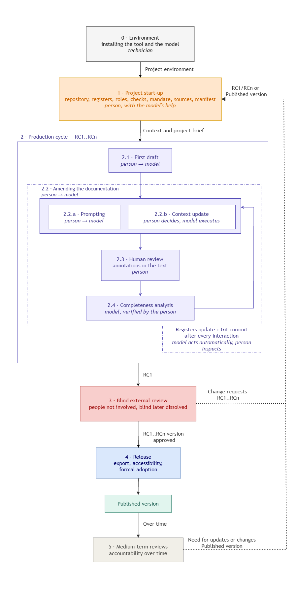

**English** · other languages of the kit: [Italiano](https://github.com/uniurbit/memento-ai-docs/blob/main/lang/it/README.md)

# Memento – AI-assisted document drafting and review

### Method specification for public administrations

*The name comes from the film of the same title, whose protagonist remembers nothing of what he has done and survives thanks to what he has written down: it is the principle the method rests on.*

**Version:** 4.9 – `31/08/2026`
**Authors:** Alessia Ventani (alessia.ventani@uniurb.it); Michele Tomassini (michele.tomassini@uniurb.it) – Ufficio Servizi per la Transizione al Digitale (Digital Transition Services Office) – Università degli Studi di Urbino Carlo Bo
**Licence:** CC BY 4.0
**Language.** This English version is the official text. Work in one language only: see [Language of the kit](#63-language-of-the-kit).

---
## Contents

- [1. Overview](#1-overview)
  - [1.1 The nature of this document](#11-the-nature-of-this-document)
- [2. Key words](#2-key-words)
- [3. Definitions](#3-definitions)
- [4. Method architecture](#4-method-architecture)
- [5. Principles](#5-principles)
- [6. Phase 0 – Environment](#6-phase-0--environment)
  - [6.1 Requirements and installation](#61-requirements-and-installation)
  - [6.2 Where the environment lives, and multiple users](#62-where-the-environment-lives-and-multiple-users)
  - [6.3 Language of the kit](#63-language-of-the-kit)
- [7. Phase 1 – Project start-up and context](#7-phase-1--project-start-up-and-context)
  - [7.1 Preliminary considerations and the project folder](#71-preliminary-considerations-and-the-project-folder)
    - [7.1.1 Roles in the drafting process](#711-roles-in-the-drafting-process)
    - [7.1.2 Preliminary checks](#712-preliminary-checks)
    - [7.1.3 The project folder](#713-the-project-folder)
      - [7.1.3.1 The folders](#7131-the-folders)
      - [7.1.3.2 The registers](#7132-the-registers)
      - [7.1.3.3 Managing Git](#7133-managing-git)
  - [7.2 First operational steps](#72-first-operational-steps)
    - [7.2.1 Initialising the repository](#721-initialising-the-repository)
    - [7.2.2 Drafting the project brief](#722-drafting-the-project-brief)
    - [7.2.3 Acquiring the sources](#723-acquiring-the-sources)
    - [7.2.4 Processing the project brief](#724-processing-the-project-brief)
    - [7.2.5 Drafting the manifest](#725-drafting-the-manifest)
      - [7.2.5.1 Sources that cannot be acquired directly](#7251-sources-that-cannot-be-acquired-directly)
    - [7.2.6 Checking the mandate and leaving the phase](#726-checking-the-mandate-and-leaving-the-phase)
- [8. Phase 2 – Production cycle](#8-phase-2--production-cycle)
  - [8.1 Action 2.1 – First draft](#81-action-21--first-draft)
  - [8.2 Action 2.2 – Amending the documentation](#82-action-22--amending-the-documentation)
  - [8.3 Action 2.3 – Human review](#83-action-23--human-review)
  - [8.4 Action 2.4 – Completeness analysis](#84-action-24--completeness-analysis)
    - [8.4.1 Unavailable data](#841-unavailable-data)
  - [8.5 Updating the registers and committing](#85-updating-the-registers-and-committing)
  - [8.6 Exit condition for the cycle](#86-exit-condition-for-the-cycle)
- [9. Phase 3 – External review](#9-phase-3--external-review)
- [10. Phase 4 – Release](#10-phase-4--release)
- [11. Phase 5 – Medium-term reviews](#11-phase-5--medium-term-reviews)
- [12. Interoperability and reuse](#12-interoperability-and-reuse)
- [13. Reference applications and observed outcomes](#13-reference-applications-and-observed-outcomes)
  - [13.1 The two projects](#131-the-two-projects)
  - [13.2 The outcome of the external review](#132-the-outcome-of-the-external-review)
  - [13.3 Portability, verified](#133-portability-verified)
  - [13.4 Frequency of clarification questions](#134-frequency-of-clarification-questions)
  - [13.5 Number of iterations](#135-number-of-iterations)
  - [13.6 Feedback on the processes](#136-feedback-on-the-processes)
  - [13.7 Efficiency and cost avoided](#137-efficiency-and-cost-avoided)
- [14. Limitations](#14-limitations)
- [15. References](#15-references)
- [Appendix 1 – What Git is](#appendix-1--what-git-is)
  - [What it is](#what-it-is)
  - [How it works](#how-it-works)
  - [How the method uses it](#how-the-method-uses-it)
  - [Why it was chosen](#why-it-was-chosen)
  - [What Markdown is](#what-markdown-is)
- [Technical appendix 2 – The interaction archive](#technical-appendix-2--the-interaction-archive)
  - [Hooking up and enabling the script](#hooking-up-and-enabling-the-script)
- [Technical appendix 3 – Local machine and shared server](#technical-appendix-3--local-machine-and-shared-server)
- [Technical appendix 4 – Collaboration between several drafters](#technical-appendix-4--collaboration-between-several-drafters)
- [Technical appendix 5 – Languages of the kit](#technical-appendix-5--languages-of-the-kit)

---

## 1. Overview

This document describes a replicable working method for drafting and reviewing complex administrative documentation (regulations, manuals, procedures) with the help of language models used from the command line, within a workflow versioned with Git.

The method sets out to address a problem common to many administrations: writing complex regulatory and management documentation takes a great deal of expert staff time, and making sure the text is complete and consistent becomes difficult when the rules to be complied with and the documents to be retrieved are numerous.

The method brings together three components that are already widespread and mature:

- a language **model**, used from the command line both to write and to review;
- a **Git repository**, which makes every change traceable, attributable to whoever made it, and reversible;
- an **iterative process between person and model**, in which the person leads, decides and validates at every step.

The expected result is a substantial reduction in production time, together with an increase in verified quality.

The method **does not depend on the model employed** and requires no software development: it uses flexible tools and licences that an administration will normally already have.

The method grew out of its authors' experience in producing real administrative documentation.
That does not make it a rigid format: phases, registers and conventions are pared down to the essentials and lend themselves to adaptation to administrations of different sizes, to different subject matters, to different organisations and tools.
What must survive in any adaptation is the core of the principles; the way the phases are organised may be changed when the context calls for it.

### 1.1 The nature of this document

This document is at once the specification of the method and the entry file of a project that is its reference implementation.
The structure reproduced below is not an example: it is the articulation required in order to use the method.

```
project/
├── PROJECT_BRIEF.md    the project mandate; read first
├── README.md           this document
├── CONTEXT/            reference documentation acquired by the administration
├── RELEASE/            final exported versions
├── TOOLS/              interaction-capture script (Technical appendix 2)
├── images/             figures for this document
└── REGISTERS/
    ├── INSTRUCTIONS.md   supplied ready-written: the operating rules of the method
    ├── PROJECT.md        empty
    ├── WORKLOG.md        empty
    └── CONVERSATION.md   empty; populated automatically by the environment
```

Folders written in capitals are the ones the method works with; those written in lower case serve the document itself.
The one exception is `LICENSES/`, whose name is prescribed by the REUSE specification and cannot be changed.

The kit ships in more than one language: the tree above is the English one, and the other languages sit in `lang/`, each in a folder of its own that mirrors this same structure.
The tree above is therefore also the working structure, that is, what remains after the choice of language prescribed in [Language of the kit](#63-language-of-the-kit).

Adoption takes two moments, both described in this document: the technical set-up of the environment, which is done once only and may be entrusted to a technician, and the start-up of the project proper (repository, registers, roles, preliminary checks, mandate and context), which is Phase 1.

---

## 2. Key words

The words below, when they appear in capitals, have **one meaning only** in this document, and do not admit the shades of meaning that everyday language would give them.
They serve to make visible, and not merely inferable, how binding each prescription is.

| Key word | Interpretation |
| :---- | :---- |
| **MUST** / **MUST NOT** | Absolute requirement. If it is not observed, the result is no longer verifiable or traceable. |
| **SHOULD** / **SHOULD NOT** | Recommendation. Reasoned exceptions are admissible, and a record of them must be kept. |
| **MAY** | Option. The element is optional and omitting it does not compromise the result. |

The same words written in lower case carry their ordinary meaning and express no obligation.

---

## 3. Definitions

**Model.** The large language model (LLM) used to write and review the texts.
In this document the term always and only means this component, and no synonyms for it are used.

**Tool.** The command-line program through which the model is used.
Model and tool are distinct components, each replaceable independently of the other.

**Project folder.** The working area that holds the whole project: the sources, the drafts, the registers and the history of the changes.
Since that history is kept by Git, the same folder is also called a *repository*: the two terms denote the same thing seen from two sides, the working area and the archive of its versions.
What a repository is, and how it works, is explained in [Appendix 1](#appendix-1--what-git-is).

**Context.** The body of reference documents gathered for the drafting: higher-ranking rules, connected acts, previous versions, minutes, requirements.
It is held in the `CONTEXT/` folder.

**Source manifest.** The ordered index of the context, with one record for each source gathered.

**Register.** A versioned file dedicated to a single category of information about the project.
The method provides for four of them, all mandatory.

**Project brief.** The file `PROJECT_BRIEF.md`, in the project's main folder, which contains the mandate: it is the first thing read in every session.

**Production cycle.** The sequence that repeats in Phase 2 and that leads from the first draft to a candidate version.

**Release candidate (RC).** The version of the document that is submitted for external review.
RCs are numbered in order:
RC 1, RC 2, …, RC *n*.
A draft internal to the production cycle is not an RC.

**Blind review.** A review carried out by people who do not know that the document was produced with the help of a model.
The blind is temporary and is dissolved once the review is concluded.

**Release.** The set of operations that turn an approved RC into a document of the administration: export, accessibility check, formal adoption.

---

## 4. Method architecture



The method is divided into six phases, one of which (Phase 2) repeats in cycles.
| Phase | Subject | Where |
| :---- | :---- | :---- |
| **0** | Technical set-up: installing the tool and the model | [Environment](#6-phase-0--environment) |
| **1** | Project start-up: repository, registers, roles, checks, mandate, sources, manifest | [Project start-up and context](#7-phase-1--project-start-up-and-context) |
| **2** | Production cycle, up to the RC ready for review | [Production cycle](#8-phase-2--production-cycle) |
| **3** | Blind external review; the outcome leads back to Phase 2 or on to Phase 4 | [External review](#9-phase-3--external-review) |
| **4** | Release: export, accessibility, formal adoption | [Release](#10-phase-4--release) |
| **5** | Medium-term reviews | [Medium-term reviews](#11-phase-5--medium-term-reviews) |

Two properties of the architecture deserve attention.
- **Numbering of the candidate versions.** The versions submitted for external review are the release candidates.
  Any review that asks for changes takes the document back into the production cycle and gives rise to a new RC.
  When the review asks for no further changes, the RC under examination becomes the release version.
- **Distribution of supervision.** Inside the production cycle the person supervises **every** step: the only automatic steps are the updating of the registers and the Git commit, which happen at the end of each exchange between person and model and remain readable in full.
  This is not a detail of representation: it is the condition on which responsibility for the result remains a person's.

---

## 5. Principles

**Portability.** The method does not depend on any particular supplier, model, tool or environment.
That independence is a design choice:
**the documentation the method prescribes is what makes projects portable.** Everything needed to pick a project up again (rules, state, history of decisions) sits in text files readable with any tool, and not in a model's session memory.
Changing model, tool or person therefore costs no more than the time it takes to read those files.

**Versioning and the distinction between contributions.** Every change MUST be recorded in Git.
The record MUST also show what the person did and what the model did: without that distinction the history says what changed but not who wanted it, and the premise of editorial responsibility falls away.
The distinction is obtained through the convention on commit messages, and through the fact that text annotated by the person is recorded in Git before being rewritten.

**Explicit memory.** What the project knows about itself MUST NOT reside solely in people's memory or in a model's session.
Decisions, state and reasons MUST be written down in stable form.
The registers are started together with the project.

**Human supervision.** The model proposes and revises; the decisions and the final validation remain the person's.
Automation does not replace judgement.

**Open formats in the process.** The work MUST be carried out in open text formats, which Git handles well.
Export to the final formats happens only after approval.

**Verifiability by third parties.** Every statement contained in the document produced MUST be traceable back to the source that supports it, including by someone who took no part in the work.
The principle holds together three requirements that look separate (the source manifest, the declaration of missing data, and the preservation in Git of the annotated versions) and that all serve to make inspectable the passage from the documents consulted to the text produced.
A document that does not allow this verification may well be correct, but it is not validatable.

---
## 6. Phase 0 – Environment

Phase 0 is **technical** and precedes the drafting: it prepares the environment the work will be done in.
It can be carried out by a technician of the administration, once only, and the project lead can start straight from Phase 1 on an environment that is already prepared.

### 6.1 Requirements and installation

- **A licence for a model usable from the command line**, already held by the administration.
  In the reference applications two tools from different suppliers were used, both covered by licences the administration already had active for other purposes.
- **The command-line tool** that gives access to the model, installed and authenticated with the administration's credentials.
- **Git** installed, plus a basic working knowledge of it from the terminal (commit, branch, comparison between versions, history).
- **A working environment** running Linux, Windows (with WSL) or macOS.
  No dedicated infrastructure and no hardware purchase are needed.
- **Python 3**, if the interaction-capture script supplied with this repository is adopted.
  It is present on any Linux distribution and requires nothing else.
- **A text editor**, used to write the mandate and to annotate the drafts outside the model's session.

### 6.2 Where the environment lives, and multiple users

The method does not prescribe where the environment should sit, but the choice between a personal workstation and a shared server bears on the continuity of the work and on how governable it is: the reasons and the precautions are in [Technical appendix 3](#technical-appendix-3--local-machine-and-shared-server). When several drafters work on the same corpus, the organisation of branches and the resolution of conflicts are described in [Technical appendix 4](#technical-appendix-4--collaboration-between-several-drafters).

### 6.3 Language of the kit

English sits at the root of the repository; every other language sits in `lang/<code>/`, in a folder that mirrors the root structure with the same file names.

**One language MUST be chosen before the work begins, and `lang/` MUST be removed.**
Keeping two copies of binding documents means they drift apart over time: one gets updated and the other does not, nobody notices, and whoever happens to read the wrong one works to superseded rules.
Removing the folder turns a permanent risk into a decision taken once, and it is what makes the file names of the method the same in every language.

The choice is carried out when the repository is initialised ([Initialising the repository](#721-initialising-the-repository)), with a single command per language, and its result is checked at the opening of every session by the rule in `REGISTERS/INSTRUCTIONS.md`: if `lang/` is still there, the model reports it and asks before proceeding.
The procedure for each language, what must stay identical across languages, and how to add a new one are in [Technical appendix 5](#technical-appendix-5--languages-of-the-kit).

---
## 7. Phase 1 – Project start-up and context

Phase 1 opens the project and builds its foundations: the repository, the registers, the roles, the preliminary checks, the mandate and the context.
It is the phase that determines the quality of the result, because the text the model produces cannot be better than the context that supports it, and it is the first in which the model does substantial work, with human verification after every operation.

The steps that follow are in order of execution.
Anyone joining once the work is under way finds them all in the repository and does not have to repeat them.

### 7.1 Preliminary considerations and the project folder

Before the writing phase begins, three matters must be considered: the roles, what is entrusted to the model, and how the space in which the work will be preserved is arranged.

#### 7.1.1 Roles in the drafting process

Roles MUST be assigned even in small structures: the method distributes execution between person and model, whereas responsibility is not distributed.
Who holds each role is then stated in the project brief.

| Role | Responsibility | Notes |
| :---- | :---- | :---- |
| **Project lead** | Defining objectives and constraints, keeping state and instructions, deciding on the merits | The model decides in no role. |
| **Drafter** | Building the context, running the cycle, keeping the worklog | May be the same person as the project lead. |
| **Validator** | Checking the result, without having taken part in the drafting | A separate role by definition. |
| **Release authority** | Authorising export and entry into the official record | The passage from draft to document of the administration is an explicit human act. |

The separation between whoever writes and whoever validates is the only mandatory separation of roles: project lead and drafter may be the same person, drafter and validator must be different people.
Assigning the four roles is the condition on which the writing and review process is governed.

#### 7.1.2 Preliminary checks

The three checks below MUST be completed **before** any document is given to the model to read.

1. **Internal policies** applicable to the documents that may be handed to a model.
2. **The contractual terms of the service** used, with particular attention to any reuse of the transmitted content to train the models.
   That term varies from supplier to supplier, from plan to plan, and over time.
   The check MUST be made against the contract or the administration panel, and MUST be noted, with its date, in `REGISTERS/PROJECT.md`.
3. **Compliance with the legislation in force.** This document describes a working method and does not give legal advice.
   The use of artificial intelligence systems by a public administration is governed by evolving rules, European and national, concerning among other things transparency about the use of these systems, traceability of their employment, and the fact that responsibility for administrative measures remains with a natural person.
   The administration adopting the method MUST verify, through its own competent structures (legal office, data protection officer, digital transition officer), that the use complies with the rules applicable at the time of adoption.
   That verification MUST NOT be replaced by adherence to the method.

#### 7.1.3 The project folder

The project folder is the working area in which the whole project lives: the sources, the drafts, the registers and the history of the changes.
The three paragraphs that follow describe its parts.

##### 7.1.3.1 The folders

The project folder is made up of:

- **`CONTEXT/`** – the reference documents.
  The content of the individual sources MUST NOT be altered: if a source is altered, all the work that rests on it is no longer verifiable.
  The composition of the collection MAY instead change (adding, removing, reclassifying, redoing the manifest) when there is a reason, which MUST be noted.
  How to organise the subfolders is decided by each project: a corpus of legislation and a collection of minutes are ordered differently.
- **`RELEASE/`** – the final exported versions.
  After the export the folder MUST NOT be modified by hand: it holds what was delivered, not what is being worked on.
- **`REGISTERS/`** – the project's four registers, described below.

The drafts being worked on sit in the project's main folder, or in a dedicated folder, in an open text format.

##### 7.1.3.2 The registers

The registers are documents readable by both person and model, which keep track of the work done over time.
The method uses four files, each with a single function.
**All four registers MUST be present and all MUST be active from the start of the project.**

| Register | Question it answers |
| :---- | :---- |
| `INSTRUCTIONS.md` | How is work done in this project? |
| `PROJECT.md` | Where has the project got to, what is decided, what is open? |
| `WORKLOG.md` | What has been done, with which checks and with what outcome? |
| `CONVERSATION.md` | What was asked of the model, and what did it answer? |

`INSTRUCTIONS.md` holds the rules the model must follow while it works, including those that govern the writing of the other registers.
How the interaction archive works is described in [Technical appendix 2](#technical-appendix-2--the-interaction-archive).

Keeping four separate registers instead of a single one is not a matter of tidiness but of functioning; comparing the two cases shows it.
- **A single register.** One file collects rules, state, activities and interactions.
  The immediate effect is that the file grows without control and within a few weeks can no longer be read through.
  The next effect is an implicit selection: whoever writes favours what is quick to note down (the activities) and neglects what calls for reflection, namely the state and the rules.
  The part that stops being updated first is therefore the part most needed by whoever takes over.
  The final effect is that the current picture can no longer be reconstructed: it stays scattered among notes from different periods that contradict one another.
- **Four registers.** Each file has its own writing rhythm, suited to its own function: a rule is corrected in place and stays short; an activity is added at the end and never rewritten; the state is rewritten when the picture changes and so stays current; an interaction records itself and does not compete with the others for the writer's attention.
  The separation also avoids the most frequent error, that of turning the state register into a second diary of activities.

In the reference repository `INSTRUCTIONS.md` is supplied ready-written and is the operating manual of the method, cast in the form of instructions the model can carry out.
The other three registers are supplied **empty**: they belong to the adopting project.
A register pre-filled with extraneous content, as a rule, never gets cleaned out.

##### 7.1.3.3 Managing Git

Git is entrusted to the model, which decides when to commit and does so, following the instructions held in `INSTRUCTIONS.md`: at every turn of the production cycle and at every change of phase.
The delegation concerns execution, not responsibility: the history remains readable and inspectable in full.

Commit messages follow the convention `type(scope): description` and correspond to the worklog entry of the same moment.
The message must also make clear **what the person did and what the model did**: commits that carry out human annotations say so.

```
docs(regulation): carry out the human annotations on section 3
docs(regulation): fill the gap on extensions found by the analysis
```

The message says **what** changed; the **why** (the decision taken, the check made, the question left open) MUST be written in the worklog.

### 7.2 First operational steps

With the premises settled, the work begins: the repository is set up, the mandate is written, the sources are gathered and the first session with the model is opened.

#### 7.2.1 Initialising the repository

The repository containing this document is copied with `git clone`.
The copy carries with it the development history of the method, which is not the history of the adopting project and MUST NOT become it: an extraneous history makes any later reconstruction unusable and confuses the attribution of changes.
**The `.git` folder MUST therefore be deleted after the copy and recreated from scratch**, so that the project's first commit coincides with its actual beginning.
Anyone unfamiliar with Git will find in [Appendix 1](#appendix-1--what-git-is) a non-technical explanation of what it is, how it works and why the method adopts it.

```shell
git clone [repository-address] project-name
cd project-name

rm -rf .git        # delete the history of the method
git init           # recreate the repository, empty, for the adopting project

rm -rf lang        # work in English: remove the other languages

git config user.name "Name Surname"
git config user.email "name.surname@example.org"
git add . && git commit -m "chore: initial project set-up"
```

The third command carries out the choice of language prescribed in [Language of the kit](#63-language-of-the-kit), in its English form.
To work in another language, replace it with the two commands that promote that language to the root and remove the folder: for Italian, `cp -r lang/it/. .` followed by `rm -rf lang`.
Either way the operation is a single, indivisible act: it cannot be half done, which is why it is written this way (Technical appendix 5).

The two configuration lines establish the name and address that will appear in every recorded version: the real ones must be given, because they are the only element that attributes changes to a person.

#### 7.2.2 Drafting the project brief

The project mandate sits in `PROJECT_BRIEF.md`, in the main folder.
It is the document that both the incoming person and the model MUST read first in every session, and it has three functions:

1. **Mandate.** Purpose of the project, perimeter, drafting principles required, documents not to be used as a basis, content already decided.
   It is the part the model cannot infer and that no other source contains.
2. **Assignment of roles.** Who decides, who writes, who validates, who authorises the release.
3. **Binding referral to the operating rules.** The project brief requires that `REGISTERS/INSTRUCTIONS.md` be read in full and adhered to throughout the work.
   The procedures (order of reading, opening and closing a turn, updating the registers, interpreting annotations, use of Git) live there and not here: the mandate changes from project to project, the procedures do not.

**The project brief MUST be filled in before the sources are gathered.** It is written in an editor, outside the model's session: gathering documentation without a defined mandate produces collections that are broad and of little relevance.
In the reference applications the mandate was written once, reread at every session and then modified only for corrections.
A mandate that exists only in the history of one session is not available to the next session: that is why the method prescribes it in the form of a versioned file.

#### 7.2.3 Acquiring the sources

- All the relevant documentation MUST be gathered in `CONTEXT/`: higher-ranking rules, connected acts, previous versions, minutes, requirements.
- The formats SHOULD be text, or easily convertible into text, so that the model can read their content in full.
- The objectives of the document to be produced, the constraints and the decisions already taken do not belong to the context: they sit in the project brief.
- File names SHOULD be meaningful and dated (`2024_regulation-X_v2.md`), so as to make the origin of every reference recognisable.
- Documents present only for background (scholarly writing, articles, presentations) MUST be listed as such in the project brief: otherwise the model gives them the weight of primary sources.

The files are simply copied into the folder: there is no need to rename or convert them.
This operation takes place outside the model's session.

#### 7.2.4 Processing the project brief

With the repository set up, the mandate filled in and the sources gathered, the first working session is opened.
From the terminal:

```shell
cd project-name
claude          # or the command of the tool in use
```

The first request is a single line:

```
read PROJECT_BRIEF.md
```

Nothing else is needed, and that is deliberate.
That document holds the mandate and refers on to the operating rules, which prescribe the opening sequence in full: checking the state of the repository, reading the register of instructions and the register of state, reading the final part of the register of activities, and surveying the sources present in `CONTEXT/`.
The model follows the chain by itself.
Listing the files for it to open is superfluous and, if the list is incomplete, harmful, because it replaces a prescribed sequence with an improvised one.

The model opens the documents in the prescribed order and closes with the **declaration of reading**: a few lines summarising the state of the project, the last activity recorded, the extent of the context and the open questions.
At the first session the registers are empty, and the declaration reports on the starting state.

```
Example of an answer at the first session

I have read PROJECT_BRIEF.md and, as prescribed, REGISTERS/INSTRUCTIONS.md,
REGISTERS/PROJECT.md and REGISTERS/WORKLOG.md; I then checked CONTEXT/.

The mandate concerns the regulation on the use of institutional e-mail,
excluding certified electronic mail. The registers of state and of activities
are empty: this is the project's first session. CONTEXT/ holds nine files, not
yet recorded in a manifest.

I note that two sections of the mandate are not filled in: the conceptual
perimeter and the holders of the roles. I can proceed all the same, but the
perimeter conditions the selection of the sources.
```

The declaration serves to verify, before the first task is entrusted, that the model has read what it had to read and has grasped the project.
If it does not match expectations, the defect is almost always in the documents (an incomplete mandate, a state register not kept up to date) and must be corrected before going on.
Requests to the model are phrased in one's own words, and the model answers in natural language.

#### 7.2.5 Drafting the manifest

The manifest is the ordered index of the sources gathered, and it is the first task entrusted to the model after the reading of the mandate.
Each record MUST carry: short code, title, provenance or address, date of acquisition, name of the local copy, and the reason the source was gathered, with an indication of the part of the work it serves.

The manifest has three functions, which together explain why it is used instead of a plain list of files:

1. it allows a citation to be verified without redoing the search;
2. it distinguishes the sources actually read from those merely retrieved;
3. it preserves the stable identifiers (the particulars of an act, the official identifiers of European sources) that outlast web addresses.

The manifest MUST be updated as the sources are gathered, one by one.
Putting it off to the end of the work makes it, in practice, incomplete.

The model can be used as support in drafting the manifest.
It is able to extract the identifying elements from the documents acquired, to propose the classification, and to put targeted questions about the elements it cannot determine on its own: the reason for the acquisition, the part of the work the source serves, whether an act is still in force.
If it has access to the network, it can also retrieve the stable identifiers and the consolidated versions of the acts cited by itself.
Checking the records produced remains the person's responsibility.
Using the model at this stage shortens the work and adds a check beyond the manual one.

```
Read all the files in CONTEXT/ and produce the source manifest:
for each one, name, type, date and relevance to the mandate.
Point out the sources you consider missing with respect to the purpose of the project.
```

The last sentence is what makes the step worthwhile: gaps in the context surface here, before the draft comes to rest on it.
The model lists the content of the folder, opens the files one by one and writes a new file, asking (depending on the tool's configuration) for authorisation to do so.

```
Example of an answer

I have read nine files and written CONTEXT/MANIFEST.md.

High relevance: legislative decree 82/2005 (articles 12 and 40), the AgID
guidelines on the creation of electronic documents, the 2019 internal
regulation on IT tools.
Medium relevance: two implementing circulars, of 2021 and 2023.
Background: four scholarly documents, which I have not treated as sources.

I consider three items to be missing: the measure of the data protection
authority referred to by the 2023 circular, which is not in the corpus; the act
establishing the role-based mailboxes, cited by the internal regulation; and
the privacy notice currently given to employees, without which the consistency
between the regulation and what has already been declared cannot be verified.
```

The three closing remarks are inferences: the model did not find those documents, it deduced that they ought to exist because other acts refer to them.
They must be verified, and if the documents exist they must be added to `CONTEXT/` and recorded in the manifest.

##### 7.2.5.1 Sources that cannot be acquired directly

It can happen that an institutional database returns an automated-check page instead of the document requested.
In that case another official source of the same act is used, its stable identifiers are preserved, and the circumstance MUST be noted in the manifest: whoever re-examines the work must be able to tell a source consulted directly from a source substituted.
Taking an act from an unqualified source without noting the substitution compromises the verifiability of the whole documentary apparatus.

#### 7.2.6 Checking the mandate and leaving the phase

Before moving on to Phase 2 it MUST be verified that the project brief is filled in in every section that requires it, that the sources gathered are consistent with the perimeter declared there, and that the manifest is complete and has been checked by the person.
Sources that have been gathered but fall outside the perimeter MUST be removed, or else declared as background material only, not to be used as a basis.

---

## 8. Phase 2 – Production cycle

Phase 2 is the heart of the method.
Every turn produces or improves the document, submits the outcome to the person, and entails updating the registers and the repository.
The cycle ends when the version is ready for external review: that version is a release candidate.

The phase is made up of four actions.
The first opens the work and is performed once only; the other three repeat at every turn, and the second gathers two operations that alternate without a fixed order.

| Action | Subject | Who acts |
| :---- | :---- | :---- |
| **2.1** | First draft | person → model |
| **2.2** | Amending the documentation: **2.2.a** prompting, **2.2.b** updating the context | the person decides, the model executes |
| **2.3** | Human review | person |
| **2.4** | Completeness analysis | model, verified by the person |

Each action is followed by the updating of the registers and the commit.

### 8.1 Action 2.1 – First draft

The first drafting task states what to produce and where, and refers to the documents already present.
There is no need to paste text into the request: mandate, sources and manifest are read automatically.

```
Draft the first version of the document the mandate provides for, in a file
draft-regulation.md in the project root. Keep to the sources in CONTEXT/.
Where a decision on the merits does not follow from the mandate or from the
sources, do not fill it in: flag it at the end of the document as an open
question.
```

The model rereads the mandate and the relevant sources, writes the file and reports what it has produced.
The text appears in the project folder and opens with an ordinary editor: the session serves to produce it, not to keep it.

```
Example of an answer

I have written draft-regulation.md: seven articles, about 1,400 words.

I followed the structure of the 2019 internal regulation for continuity with
the administration's other acts, and I took the definitions from legislative
decree 82/2005 rather than framing new ones.

I have left three questions open, listed at the end of the document:
1. retention period after the end of the employment relationship: the sources
   give two years in one case and five in another, and the difference is not
   explained;
2. the regime for seconded staff, which no source governs;
3. identification of the office responsible for deactivating the mailboxes:
   the choice is organisational and does not appear to have been decided.

On point 1 I can offer a reading, if useful: the difference seems to depend on
the nature of the mailbox, personal or role-based. It is an inference to be
verified.
```

The model may put **clarification questions** about ambiguous requirements, and answering them is part of the work: the answers count as decisions.
The questions MUST be invited in the project brief, but they MUST NOT be treated as a control: there is no guarantee that the model will put them.
The controls are the human review and the external review.

### 8.2 Action 2.2 – Amending the documentation

Once the first draft has been produced, the work proceeds cyclically by amending either the document or the material it rests on.
The two operations below follow no fixed order and alternate according to what the turn has brought to light.

**2.2.a Prompting and refinement.** The model is asked to extend, correct or reformulate parts of the text, or to argue a reading it has proposed.
One interacts with it as with a colleague expert in the subject: the objective is explained, questions are put, conclusions are contested when they do not convince.
The model reasons and draws inferences (it connects provisions from different texts, deduces unwritten consequences, detects contradictions), and an account MAY be demanded of each inference.

```
Develop the reading of point 1: which passages do you draw it from, and what
would it imply for role-based mailboxes shared between several offices?
```

The answers are plausible arguments, not findings of fact: they must be checked against the sources, and the checking falls to the person.

**2.2.b Updating the context.** Every turn may expose an insufficiency in the context: a source not gathered, a classification to be revisited, a manifest record to be redone.
The content of the sources MUST NOT be altered; the composition of the collection MAY change when there is a reason, which MUST be noted in the manifest and in the worklog.

```
Add to CONTEXT/ the measure of the data protection authority you flagged as
missing, record it in the manifest noting that it was acquired during the work,
and tell me which passages of the draft are affected by it.
```

### 8.3 Action 2.3 – Human review

The person examines the proposal, corrects it and decides.
The way the correction is carried out is one of the elements that characterise the method.

**The text produced by the model MUST NOT be corrected directly.** The person intervenes by inserting **annotations** into the text, which the model reads, interprets and carries out at the following turn, producing a new clean version.
The annotation describes the intervention wanted ("this passage needs extending", "the reference to article 12 is missing", "this distinction is not correct, it holds only for fixed-term staff") and is interpreted by the model at the next passage.

Annotations MUST be unmistakably distinct from the text, without being confused with ordinary punctuation.
For this purpose the method uses, as delimiters, three opening and three closing angle brackets (<<<...>>>), placed immediately after the passage they refer to:

```
The mailbox is deactivated two years after the end of the employment
relationship.<<<specify that the period runs from the date of formal
termination and not from the last access; add the reference to art. 12>>>
```

The choice of three repeated characters is not casual: the sequence does not occur in administrative language, it survives conversion between text formats, it can be searched for with a simple expression, and it does not clash with Markdown syntax.

Annotations are written **in the file itself**, opened with a text editor outside the model's session.
**The annotated state MUST be recorded in Git before the model rewrites it:** it is that commit which preserves the human intervention, and without it, carrying them out would erase the annotations leaving no trace of them.

The operation is **automatic**: when the model takes charge of an annotated file, the first thing it does is record its state as it stands, with a message declaring the presence of human annotations still to be carried out; only then does it carry them out.
The prescription is in `REGISTERS/INSTRUCTIONS.md`.

The interaction with the model now serves to have the annotations processed; it produces the clean version and removes from the text only those that have been carried out.
Annotations not carried out, not understood, or in conflict with other instructions are not removed, and the circumstance is reported so that the person can decide.

```
Take charge of draft-regulation.md: carry out the annotations, produce the clean
version of the document and remove only the annotations actually carried out.
List the ones you did not carry out, with the reason.
```

```
Example of an answer

I recorded the annotated state of the file before touching it
(docs(regulation): record the human annotations on section 3).

I then found eleven annotations and carried out ten of them; I rewrote
draft-regulation.md in the clean version, removing only the ten carried out.

I did not carry out the annotation at art. 4 ("extend the rules to role-based
mailboxes"): it conflicts with the annotation at art. 2, which asks for them to
be excluded from the perimeter. The two instructions cannot be combined and the
choice is one of merit. The annotation stays in the file, awaiting a decision.
```

The annotated version and the clean version are two successive commits of the same file, and both can be retrieved from the history.

The complete operating procedure (recognition, order of execution, removal, treatment of annotations not carried out or not compliant, prior archiving) is in `REGISTERS/INSTRUCTIONS.md`, the file the model reads at every session.

There are three advantages to this way of working.

- **Demonstrability.** The annotation is an artefact, not a recollection: months later it is possible to reconstruct which human observation produced which change, and the human review can be shown to third parties instead of merely being asserted.
  In a process where responsibility remains the person's, being able to exhibit one's own intervention is a protection.
- **Consistency of style.** The text is written entirely by the model, which keeps register, terminology and sentence construction uniform.
  Correcting by hand instead produces perceptible breaks in style (a rewritten paragraph stands out from the rest) which in a regulatory document become interpretative uncertainty.
  By delegating execution to the model, the correction enters the text in the text's own voice.
- **Separation between decision and execution.** The annotation compels one to say what is wrong and why, whereas direct correction allows an intervention without any reason being given.
  The reason, once written, remains available to whoever re-examines the work.

### 8.4 Action 2.4 – Completeness analysis

Beyond the drafting, the model MUST be asked for a **check of completeness and consistency** against the whole context: missing references, supporting documentation needed, inconsistencies with the rules in force.

The analysis is done **after** the human review.
Its placement is substantive: the model analyses the text in the wording the person wanted, and not a draft destined to be corrected, so the gaps it finds are gaps in the real document.

```
Check the document against all the sources in CONTEXT/: missing references,
inconsistencies with the legislation cited, passages with no foundation in the
sources. List the findings without modifying the text.
```

The request not to modify the text is deliberate: what is needed is the list, so that its acceptance can be decided, not a new already-corrected version.

```
Example of an answer

Four findings.
- Art. 3 refers to "the legislation in force on data protection" without
  identifying it; the other provisions of the text give the particulars.
- Art. 5 provides for the employee's consent to access the mailbox; the measure
  of the data protection authority held in CONTEXT/ instead bases that access
  on a different premise. The wording needs re-examining.
- Art. 6 provides for logs to be kept for twelve months: the period has no
  foundation in any source in the corpus. If it derives from an internal
  decision, that decision should be cited.
- The document does not govern the case of the holder's death, which the
  guidelines expressly address.
```

Every proposal must be verified before being carried out.

#### 8.4.1 Unavailable data

When administrative documentation is written, some of the information needed is not available: an annex never drawn up, a periodic report never produced, a supplier's answer that never arrived, an act whose validity cannot be established.

**The absence MUST be declared; plausible content MUST NOT be produced.** In practice:

- the document MUST contain an explicit placeholder stating what is missing and why ("report not drawn up", "awaiting reply") and MUST NOT contain a plausible-looking text in its place;
- the list of items to be verified MUST accompany the draft as a section of its own, with one entry for each gap;
- the model MUST be expressly instructed to this effect, because its natural inclination is to complete rather than to flag, and compliance with the rule MUST be checked.

The reliability of the method with the offices that have to validate depends on this rule.
A document that declares its own gaps is usable: the reader knows its limits.
A document in which the gaps have been filled with plausible-looking text is not validatable, because the validator has no way of knowing which statements to check, and the gap resurfaces after the act has been adopted.

### 8.5 Updating the registers and committing

At the end of every action, and in any case of every exchange between person and model, two automatic operations are performed: updating the registers and committing.

- `WORKLOG.md` receives an entry if the activity is significant: a step forward in the document, a decision taken, a check that changes how far the result can be trusted.
  An entry MUST NOT be written for every single command.
- `PROJECT.md` is updated only when the overall picture changes.
- `CONVERSATION.md` is populated by the environment, or by the model in those cases where the environment does not do it ([Technical appendix 2](#technical-appendix-2--the-interaction-archive)).
- The commit closes the iteration, with the distinction between human intervention and model intervention prescribed by the convention on commit messages.

### 8.6 Exit condition for the cycle

The cycle ends when the version survives a complete reading without any substantive change emerging, and when the findings of the completeness analysis no longer bear on the merits.
That version takes the number **RC 1** and passes to Phase 3.

---

## 9. Phase 3 – External review

The document MUST be submitted to people who took no part in the drafting.
The separation between whoever writes and whoever validates is the method's only mandatory separation of roles.
**The model is not employed in this phase:** the review is carried out entirely by people, and it is the moment when the work leaves the circuit that produced it.

**Temporary blind.** The review SHOULD be carried out by people who do not know that the draft was produced with the help of a model, so as to obtain a judgement uninfluenced by that information.
The blind is temporary and MUST be dissolved once the review is concluded, by telling the reviewers how the text was produced.

Both steps are needed.
The blind makes the judgement unconditioned; the unblinding makes it usable: a validation whose author does not know what it was about cannot be cited, and a reviewer who finds out by chance that they have validated a text produced with a model will not repeat the exercise.

**Recording the outcomes.** The observations received MUST be recorded, together with how many were accepted and how many rejected, and for what reason.
The record serves quality and transparency, and it belongs in the worklog.

**Outcomes.** If changes are requested, the document returns to Phase 2: the cycle produces a new version, numbered RC 2, and so on up to RC *n*.
If none are requested, the RC under examination passes to Phase 4.

---

## 10. Phase 4 – Release

The passage from draft to document of the administration is an explicit human act, falling to the release authority.
The phase comprises three operations.
- **Export.** The approved version is converted from the working format to the administration's standard formats and deposited in `RELEASE/`.
  After deposit the folder MUST NOT be modified by hand.
- **Accessibility check.** The consistency of the headings, the selectability of the text, the correct mark-up of the tables and the suitability of the final format for preservation and access MUST all be verified.
  Using the model for a structural check prior to conversion, with human review of the outcome, has proved effective: it is a task with explicit and verifiable requirements, and in those conditions the model performs well.
  The check nonetheless remains subject to review and MUST NOT be delegated in its entirety.
- **Formal adoption.** The document enters the administration's body of rules by the appropriate act (decree, resolution, determination) and is published where required.
  Adoption and publication are distinct steps and should not be conflated.

---

## 11. Phase 5 – Medium-term reviews

A regulation or a manual is not exhausted by its publication: rules, systems and organisations change.
Many documents are moreover subject to mandatory periodic review.
Some time after publication, whoever picks a document up again always meets the same four situations, and to each of them an element of the method responds:

| Situation | Element that responds to it |
| :---- | :---- |
| Work resumes after months and no one remembers why a sentence was written the way it was | `WORKLOG.md`, which preserves the reason and the check |
| New staff arrive, who would otherwise have to interview whoever worked on it before | `PROJECT_BRIEF.md` and `PROJECT.md`, which make the interview superfluous |
| The version of the model has changed, or another tool is in use, and the set-up of the previous session cannot be recovered | The project brief, which holds the mandate in a form independent of the tool |
| Someone asks what exactly was asked of the model and what it answered | `CONVERSATION.md`, the only register that answers |

Phase 5 is therefore the moment when the investment made in Phases 0 and 1 pays off.
There are three reasons.
- **One reopens instead of reconstructing.** Picking the work up again costs the time it takes to read the registers, not the reconstruction of a lost context.
- **The sources are already classified.** The check typical of a review (which legal references have changed in the meantime) is a mechanical operation if a manifest with stable identifiers exists, and a long one if it does not.
- **Accountability.** A document for which it is possible to reconstruct, long afterwards, who decided what, on which sources and with which checks, is a defensible document.
  This property cannot be built after the fact: it accumulates during the work, thanks to the recording being automatic.

**How it is run.** A medium-term review re-enters from Phase 1: the context is reopened, changes in the sources are checked, the manifest is updated.
If changes emerge, the ordinary process resumes in the production cycle, up to a new RC and an external review proportionate to the extent of the changes.

---

## 12. Interoperability and reuse

The method is designed to be used across different organisations: it rests on open standards, creates no supplier dependency and imposes the adoption of no new systems.
What follows is the correspondence with the four layers of the **European Interoperability Framework (EIF)**.

**Technical interoperability.** Git is an open standard, compatible with any toolchain; the working format is plain text, readable even without dedicated software.
No component of the method is proprietary: the only element tied to a specific product is the file that refers on to the project brief, kept separate on purpose so that it can be replaced.
In the reference applications the drafts circulated inside the administration using the collaboration tools already in use, which are a choice of the administration and not a requirement of the method.

**Semantic interoperability.** The registers exist so that meaning is preserved as work passes between people, offices and tools: each file has a declared function.
The final documents are produced in the administration's standard formats and fit into the existing document systems without imposing new ones.
The completeness analysis checks the consistency of the product against the body of rules in force.

**Organisational interoperability.** The six phases and the roles of the method are an explicit governance model, adoptable without adaptation and transferable to other administrations.
It is the component of the method that is easiest to reuse, because it depends on no technology.

**Legal interoperability.** The method rests on licences already held and on standard tools: it introduces no contractual constraints and no further barriers.
The traceability guaranteed by the registers supplies the evidence an administration must be able to show about its use of AI systems: what was asked, what was produced, who decided and who validated.

**Communication and openness.** The initiative is public on two planes.
Outwardly, the method is published in full in an open repository, under the CC BY 4.0 licence and with a machine-readable licensing declaration following the REUSE 3.3 specification: anyone can examine it, reuse it and propose changes through an issue or a pull request, and the traceability of the registers makes the use of the AI system inspectable from outside.
Inwardly, the method is documented in full and is applied in the office that produced it: whoever takes part in the drafting works on written, shared registers, not on tacit knowledge.
The unblinding provided for at the end of the external review is the moment when this openness enters the process: the reviewers are told how the text was produced, and the colleagues who validate the documents are thereby made explicitly aware of the use of the AI system.

**Contributions.** The repository is open to contributions.
Observations, corrections and proposed changes are submitted through an issue or a pull request, or by writing to the contact given at the end of this document.

---

## 13. Reference applications and observed outcomes

The preceding sections describe the method.
This one recounts the experience the method derives from, and what was observed in it.

### 13.1 The two projects

The method was built by working, not at a desk.
The two applications are real documents of a public university, both intended for formal adoption.
They are described by type, without giving their particulars.

**First case: a technical manual required by national guidelines**, accompanied by some ten annexes and adopted by act of the administrative head.
It is the more demanding of the two: the context comprised acts of the administration, contracts, an external supplier's manuals and operating agreements, amounting to about **1,150 equivalent pages of documentation analysed**.
The work took **eight effective working days**, with **27 commits**, and produced **83 text files of about 136,000 words** between drafts, annexes and registers.

**Second case: an internal regulation on the use of a digital tool by staff.** A shorter text but with a dense regulatory structure, touching on data protection, the employment relationship and continuity of service.
A context of about **220 equivalent pages**, **five effective working days**, **23 commits**, **18 files of about 78,000 words**, **ten versions** of the regulation, five of them annotated by the person and carried out by the model.

Overall:
**50 commits, thirteen effective working days, about 1,370 pages of documentation analysed, about 214,000 words produced.** The environment was an existing shared Linux server, with no infrastructure dedicated to the project and no purchases: shell, filesystem, Git and two command-line tools covered by licences already in use in the administration.

The most useful figure is none of these, but the ratio between them.
Thirteen effective working days on documentation of this size would not have sufficed with the traditional method, and would not suffice with a model used without registers either: what would be missing is what allows the work to be picked up again the next day without reconstructing the context.
The time saved does not come from the model's writing speed, but from the fact that no session starts again from nothing.

### 13.2 The outcome of the external review

In the first case the external review involved, case by case, the offices competent for the matters dealt with, and took about three person-days in all.
The reviewers gave technical opinions on the points they considered most sensitive, integrating the text where necessary: the changes requested were minimal and the overall structure was left untouched.
The blind was dissolved once the review was concluded, before adoption.

Asked after the unblinding, one of the reviewing offices described the experience; the judgement is quoted with its consent, anonymously, for what it says and for what it does not conceal.
On quality: "Overall, the document offered a solid base and was decidedly complete, standing up well to comparison with similar texts".
The integration came where it had to come: the reviewer personally runs some of the processes dealt with, whose detailed specifications "were in my exclusive possession", and their contribution made those explanations "genuinely precise, accurate and usable by the reader".

On how the blind held: the suspicion that a model had been used was "very slight and entirely circumscribed", limited to "a couple of sentences" which the reviewer put down to an assisted rereading of those passages alone: "I never thought of a text generated from scratch".
After the unblinding: "My judgement remains entirely unchanged", of a text considered "almost entirely indistinguishable from human writing".

The reviewer's conclusion coincides with the thesis the method is built on, and is the more credible for having been formulated by someone who, while reviewing, did not know the method: "AI can prepare an excellent theoretical container, but the contribution of those who govern the processes in the field remains indispensable to enrich that container with the operational specifics that no machine can possess".

The quotations are translated from the reviewer's Italian; that wording is quoted in the Italian version of this specification.

### 13.3 Portability, verified

Months after the two projects closed, a model from a supplier other than those employed, with no contact with the people involved, reconstructed the state of the projects by reading the registers alone: what had been produced, which sources had been used, which questions had remained open and why the choices had been made the way they were.
There was no need to talk to anyone.

In the same period, inside the first of the two projects, tools from two different suppliers worked on the same repository reading the same registers, with their perimeters written in separate files.
It is direct evidence of the principle of portability: the cost of the change was no more than the analysis of the project's files.

### 13.4 Frequency of clarification questions

In the reference applications the clarification questions put by the model were **infrequent**, even when the instructions expressly invited them.
It is the observation from which the rule stated for the first draft derives: questions are to be asked for, but control cannot rest on them.

When a question does come, however, the return is high.
Once the model has the operator's answers, it reworks them and widens the analysis, identifying any gaps in the documentation produced and adopting the choices taken.

The outcome shows what the method is for: the model does not take decisions in the operator's place.
When it does not know how to proceed, it puts a question.

### 13.5 Number of iterations

In the reference applications two to three turns of the production cycle were needed to bring a document from the first draft to a consolidated version.
The figure was not measured systematically and varies with the size of the corpus and with how well defined the initial mandate is.

### 13.6 Feedback on the processes

The gaps found during the review do not concern only the document being worked on.
Some of them arise further upstream, in the way the organisation works, and the fact that they surface is an outcome of the method distinct from the document produced.
It is the most recurrent observation of the two applications: in both cases reviewing the text ended up bringing to light problems that the text, on its own, could not solve.

There are three recurrent types.
**Organisational gaps**: a duty required by the rules that no structure is responsible for, or a task assigned to an office whose competences have changed in the meantime.
**Gaps in the document flows**: documents that ought to be produced when a certain event occurs and are not, or that are produced and not preserved, or preserved and not retrievable.
**Gaps in ownership**: activities that really are carried out but have no formally identified owner, and that surface at the moment the document has to name one.

None of these problems is solved by changing the text.
The review, however, makes them visible and documented: the document being worked on functions as a diagnostic instrument on the organisation that produces it.
The outcome should be collected in a separate list, addressed to the competent structures, and may lead to organisational measures (reassignment of competences, redefinition of flows, adoption of missing acts) that go beyond the production of documents.
Those measures are not part of the method described here, but the method makes them visible.

### 13.7 Efficiency and cost avoided

**Efficiency compared with the traditional method.** A comparable manual, in the same field and of the same size, had previously been produced by a single person over about eight months of calendar time, carried out alongside other office duties and with a result that was still incomplete.
With the method, an equivalent and fully traceable document was completed in **eight effective person-days**.
Expressed in the same unit, and on the prudent assumption that only a fraction of those eight months was actually devoted to the manual (between 25 and 40 effective person-days), the comparison indicates an estimated reduction of **between 65 and 80 per cent of expert effort**, with delivery compressed from months to days and a more complete result.
The figure for the traditional effort is an estimate based on recollection, and is declared as such: it is the same principle by which the method requires assumptions to be made explicit instead of being presented as measurements.

**Public value and cost avoided.** The result was obtained with no dedicated infrastructure and no purchases, on an existing Linux server and with licences the administration already held: the project's marginal cost is close to zero.
Beyond efficiency, the method produces value that traditional writing alone does not replicate: verifiable traceability of the use of AI (what was asked, what was produced, who decided and who validated), accountability that is defensible over time and, as a documented outcome, the surfacing of organisational gaps that the text alone would not have made visible.

---

## 14. Limitations

The limitations below are known and declared.
Some can be mitigated, none can be eliminated: whoever adopts the method should know them beforehand, not discover them along the way.

**The method does not decide.** The model proposes text; the decision and the validation remain the person's, and every content MUST be verified.
This limitation is not a stylistic caveat: the model can produce erroneous or incomplete statements with the same fluency with which it produces correct ones, and the form of the text does not allow them to be told apart.
It is the reason the method provides for a human review at every turn and an external review before release, and does not settle for a final check.

**Wrong or non-existent legal references.** This is the most dangerous particular case of the previous limitation, and deserves to be stated separately.
The model can cite an article that does not exist, attribute a provision to the wrong act, or invoke a version no longer in force, in a perfectly plausible form: the number looks right, the title of the act is correct, the sentence is well constructed.
The source manifest reduces the risk, because it compels the stable identifiers of the acts to be preserved, but it does not eliminate it.
**Every legal reference in the final text MUST be verified against the official source by a person.** Entrusting the check to a second model is not, as things stand, a solution: it moves the problem without solving it.

**Recurrent errors of the model.** Two recurred often enough to call for a rule.
The first: the model treats documents present only for background (scholarly writing, articles, presentations) with the same weight as primary sources, and derives statements from them as though they were binding; the correction consists in expressly listing, in the project brief, the documents not to be used as a basis.
The second, its opposite: in important passages the model tends to produce over-compressed lists, losing precisely the argument that was needed there; the correction consists in asking for the passage to be extended.
Neither is settled once and for all: they come back, and recognising them is part of the work of whoever runs the drafting.

**The results are not reproducible over time.** The same request, put to the same model in a later version, does not produce the same text.
The method guarantees traceability of what was produced (what was asked, what was answered, what was decided) but not repeatability of the production: no one can rerun the work and obtain that document again.
The operational consequence is that the evidence to be preserved consists of the artefacts and the registers, not the instructions given: anyone who thinks a document can be "regenerated" from stored prompts will end up with a different text, and will have to review it from scratch.

**The result depends on the quality of the context.** An incomplete or disorderly context produces weak results, and the model does not say so: it works with what it has.
Phase 1 is not optional, and the time that seems to be saved by skipping it comes back multiplied in the production cycle.

**Legal verification.** For documentation with legal effects, validation by qualified expertise remains indispensable, and the method does not replace it: it makes the path that led to the text inspectable, it does not certify that the text is correct.

**It is not suited to short or urgent documents.** The apparatus of registers, manifest and cycles pays for itself on long, complex pieces of work that stop and start over time and involve several people.
On a two-page note to be delivered the same day, the set-up cost is not recovered.
The method is calibrated for complex regulatory and management documentation: applying it outside that perimeter produces bureaucracy with nothing in return.

---

## 15. References

- Repository of the method: https://github.com/uniurbit/memento-ai-docs.git
- Licence: [CC BY 4.0](https://creativecommons.org/licenses/by/4.0/), for every file in the repository
- Contact:
  [ufficio.transizionedigitale@uniurb.it](mailto:ufficio.transizionedigitale@uniurb.it)

**One licence, for every file.** The whole repository is under CC BY 4.0: the specification, the fillable templates and the interaction-capture script.
Anyone reusing it, in whole or in part, need only cite where it came from.
The `LICENSE` file carries the full text, and it is the file that hosting platforms detect and display.

**The documents produced by whoever adopts the method are not covered by this licence.** The templates are made to be filled in: the mandate, the registers and the drafts an administration writes using them are its own works, of which it disposes freely.
The licence covers the files distributed here, not what is written inside them.
No obligation of attribution, sharing or reciprocity therefore falls on the acts of the adopting administration.

**Machine-readable declaration.** The repository conforms to the [REUSE 3.3](https://reuse.software/spec-3.3/) specification of the Free Software Foundation Europe, which the European reuse ecosystem already adopts.
The `LICENSES/` folder holds the text of the licence with its SPDX name, `REUSE.toml` associates it with all the paths in the repository, and the script carries the `SPDX-License-Identifier` header inside itself.
An evaluator, or an automated tool, can therefore establish file by file which licence applies, without having to deduce it from the text.

---

## Appendix 1 – What Git is

An explanatory appendix, addressed to readers without a computing background.
It contains no prescriptions: those are in the body of the document and in the registers.

### What it is

Git is a register of the versions of a working folder.
Every time one decides to fix a state of the work, Git keeps a complete copy of all the files and all the subfolders, with the date, the name of whoever fixed that state, and a short description.
The copies do not overwrite one another: the folder always holds the latest version, while all the earlier ones remain available and unmodifiable.

### How it works

One works on the files in the usual way and with the usual tools: writing, correcting, deleting.
When one decides to, one asks Git to take a "snapshot" of everything that has been done.
The record is called a *commit* and holds four pieces of information: who saved, when, what changed with respect to the previous version, and for what reason.
The last of these is the message accompanying the commit: it is chosen by whoever makes the commit and may be very terse or very explanatory.

Three possibilities follow from this structure that an ordinary working folder does not offer:

- **comparison between versions of the documents**: one sees which lines changed between two versions, without rereading the whole document;
- **recovery of old versions**: one can go back to an earlier version even months later, without having had to foresee that it would be needed;
- **working in parallel**: several people can work on separate copies, called branches, and then bring the work together; if they have modified the same passage, Git reports it instead of overwriting it.

All of this resides in a hidden subfolder of the project.
No external service has to be activated and the documents stay where they are.

### How the method uses it

In the method the commands are not run by hand: the model runs them, at the end of each turn of the production cycle and at every change of phase, following the instructions held in `REGISTERS/INSTRUCTIONS.md`.
What remains with the person is the decision on the merits, the annotation of the drafts, and the checking of what has been recorded.
How the repository is initialised and which convention the commit messages follow is described in Phase 1; the prohibitions that admit no exception are in `REGISTERS/INSTRUCTIONS.md`; the work of several drafters on the same corpus is in [Technical appendix 4](#technical-appendix-4--collaboration-between-several-drafters).

One clarification is useful to whoever reads the history:
Git records the documents, not the exchange with the model.
The requests and the answers are kept in a dedicated register, fed while the session is under way ([Technical appendix 2](#technical-appendix-2--the-interaction-archive)).
The two trails are complementary and neither replaces the other.

### Why it was chosen

**It makes what happened verifiable.** In work carried out with a model one must be able to show a third party which version the model produced, which human observation intervened, and, by comparison, which changes the model made.
All of this is possible thanks to Git.

**Order does not depend on the diligence of whoever is working.** Numerous working copies renamed by hand, of the `document_v2_final_def` kind, produce archives in which it is no longer possible to tell which version is the valid one, or why.
With Git, order is guaranteed by the tool.

**It is free, open and widespread.** It is the current standard for versioning, it ties one to no supplier, it involves no licences and no dedicated infrastructure, and it remains readable years later.

**It suits text documents.** The method's files are in an open text format and the comparison between versions happens line by line; on binary formats the same comparison would not be readable.
Git is moreover already present in Linux environments and already familiar to anyone with development experience: it does not introduce a new tool to be learnt, it reuses an available skill.

### What Markdown is

The open text format adopted in the method is called Markdown, and the files that use it have the extension `.md`.
A Markdown file is an ordinary text file: it opens with any editor, requires no particular program, and stays readable many years from now.
On Windows, Notepad (already present in the system), Notepad++ and Visual Studio Code are all suitable; on macOS, TextEdit, BBEdit and again Visual Studio Code; on Linux, gedit, Kate, or `nano` straight from the terminal.
Some programs (Visual Studio Code, Typora, Obsidian) also show a preview of the formatted text, but they are not necessary: the file stays the same in any case.

The difference from any other text file lies in a few writing conventions, which indicate the structure of the document without hiding it in an internal format:

```markdown
# Document title
## Section title

A paragraph is written normally.

- a bulleted list begins with a hyphen
- and continues on the following lines

Text **in bold** is enclosed between two asterisks on each side.
```

The conventions are learnt in a few minutes and the text stays comprehensible even to someone who does not know them: a title preceded by a hash reads as a title in any case.

The format was chosen for three reasons.
It is readable by person and model alike with no intermediate conversion.
It allows Git to compare line by line, which would not be possible on a word-processor file.
At the moment of release it can be converted into the formats required (PDF or word-processor document) without the working text having to be rewritten.

---

## Technical appendix 2 – The interaction archive

How each register is written (edited in place, added to at the end, fed automatically) is described in `REGISTERS/INSTRUCTIONS.md`.
Of the four registers, three are written during the work like any other document.
The fourth is not, and the difference has to be explained because it entails a decision to be taken in Phase 0.

What the archive has to preserve (the exact text of what was asked and of what was answered) exists only at the moment the turn takes place.
It cannot be reconstructed afterwards:
Git records the document, not the exchange, and people's memory is not enough.
Either it is captured as it happens, or it does not exist.

There are two possible routes, and they are mutually exclusive.

*First route: a script hooked to the tool.* Almost all command-line tools run an external command at certain moments of their own operation.
Two are needed: the sending of the request and the completion of the answer.
A script hooked to those two moments appends the text to the end of the archive.
It is the route to prefer, for three reasons: it copies the text without reworking it, it always fires, and it consumes no processing resources.
This repository supplies the implementation (`TOOLS/record_interaction.py`, Python 3 and the standard library alone) with the caveat that the hook is the only point at which the method touches a specific product: adapting it to another tool means modifying a single part of the script.

*Second route: recording carried out by the model.* When the tool does not signal those two moments, at the end of each turn it is the model itself that writes the two ends.
The route works, but it has a cost and a limitation.
The cost is computational: the text has to be reproduced, and reproducing it consumes resources in proportion to its length, at every turn.
The limitation is of another nature: whoever records coincides with whoever is recorded, the completeness of the archive depends on the model not omitting to write, and no internal control can detect the omission.
The method sets two safeguards against this (the obligation to transcribe verbatim, with no undeclared summarising, and the declaration of the capture mode in every record) which make the circumstance inspectable without eliminating it.

### Hooking up and enabling the script

Declaring the script is not enough to put it into operation.
This is the point at which adoption most often stalls, and it is worth explaining at length.

**Why an explicit act is needed.** A hook of this kind causes code to be run on the user's machine at every turn, with the user's own permissions.
That is why tools do not activate it merely because a configuration file exists: they ask for separate consent, given by a person through the tool's interface.
It is not an obstacle, it is a guarantee, and in this case it carries a second one:
**the model that would be recorded cannot authorise its own recorder.** Activation is, and must remain, a human act.

**The three steps, the same for any tool.**

*First – declaration.* In the tool's configuration file two hooks are declared, one per event, giving the command to run and a maximum execution time.
The declaration SHOULD sit in the project configuration and not in the user's, so that it travels with the repository.
Bear in mind that **what travels is the declaration, not the enabling**.

```
event "request sent"        → command: python3 TOOLS/record_interaction.py
                              maximum time: 10 seconds

event "answer completed"    → command: python3 TOOLS/record_interaction.py
                              maximum time: 20 seconds
```

*Second – enabling.* This is the human act.
Its form changes from product to product, but three modes recur: an interactive command that lists the declared hooks and asks for approval of each one; a request for confirmation at the first start after the declaration; or a trust setting applied to the whole project folder.
**The enabling MUST be given for both events.** Approving only one of them is by far the most frequent way of ending up with a halved archive without noticing.

*Third – verification.* One carries out an ordinary turn and checks that the archive holds both ends of that turn.
It is the only proof that counts: the presence of the declaration in the configuration file does not prove that the enabling has taken place, and the two states are indistinguishable from outside.

**What changes between products.** The name and location of the configuration file; its syntax; the names by which the two events are called; the way the enabling is given; whether the maximum time can be configured.
**What does not change:** two events are needed, not one; the command run is the same for both; the enabling is a human act distinct from the declaration; the verification is done in the field.

**When the hook does not fire.** The recurrent causes, from the most frequent to the least:

1. declared but never enabled;
2. enabled for one event only;
3. the command path computed relative to a folder other than the project one: give a path relative to the root of the repository, or an absolute one, and verify it;
4. the script lacking execution permission, or the interpreter not found: invoke `python3 <path>` instead of relying on the file's first line;
5. maximum time too short for turns with long answers;
6. a non-interactive session, or a mode of execution in which the tool does not activate the hooks.

**When the enabling has to be redone.** It refers to the machine and the user: whoever copies the repository onto another workstation repeats it.
It must also be redone after every change to the declaration, and some tools revoke it when they update.
After every renewal the verification of the third step is repeated.

**Before enabling.** Read the script.
It is code that will be run at every turn with the user's permissions, and the recommendation holds for the one supplied with this repository as for any other.

*No middle route.* A configuration that intercepts only one of the two events is not admissible: it would produce an archive holding half of each turn without declaring it, which is the worst condition of all, because it looks complete.
Either the configuration is completed, or it is switched off in favour of the second route.
The operational prescriptions for the two cases are in `REGISTERS/INSTRUCTIONS.md`.

*What happens if nothing is done.* `CONVERSATION.md` stays empty.
The project keeps its state, its activities and the history of its changes, and loses the one thing none of the other registers keeps: what was actually asked of the model and what it answered.
The loss is not felt while the work is going on (which is what makes it insidious) and shows itself in Phase 5, when months later it becomes necessary to establish on what basis a wording was adopted, or when the administration has to document how it used an AI system.
By then the information cannot be recovered: the window in which it existed closed at every turn.
A project without an interaction archive remains usable, but it does not conform to the method, and the non-conformity MUST be declared in `PROJECT.md` instead of being left implicit.

---

## Technical appendix 3 – Local machine and shared server

The method does not prescribe where the working environment should sit, but the choice bears on the continuity of the work and on how governable it is.
The two options are the drafter's personal workstation and a shared server, usually a virtual machine in a data centre of the administration or of a supplier.

**The shared server SHOULD be preferred** when even one of these conditions applies: the project lasts more than a few weeks; more than one person works on it; the documentation produced is intended for formal adoption.
The reasons are as follows.

*Independence from the workstation.* The work is reachable from any machine with a remote connection.
Replacing, repairing or updating the personal computer does not interrupt the work, and a colleague taking over does not have to rebuild an environment.

*Stability of the infrastructure.* A data centre guarantees electrical continuity, air conditioning, network redundancy and physical security of the premises: conditions an office workstation does not reproduce.
A project lasting months, on a personal workstation, runs a risk of interruption out of all proportion to the value of the work.

*Safeguarding and preservation.* The administration's backup and preservation procedures apply of their own accord.
The Git history already protects against accidental loss of content, but not against loss of the medium: the two protections are complementary and neither replaces the other.

*Uniformity of the environment.* Tool versions, configurations and the context folder are single and shared.
This avoids two workstations diverging without anyone noticing, something usually discovered when two drafters obtain different results from the same request.

*Governability.* Access, authorisations and usage trails are administered in one place and can be verified.
For an administration that has to demonstrate how it used an AI system, the difference from a personal workstation is substantial.

*Economic sustainability.* A single virtual machine serves several drafters and several projects, at a running cost lower than the sum of the equivalent workstations.

**Precautions.** The advantage is not unconditional.
A shared environment reachable from outside requires: access with personal credentials and robust authentication, exposure limited to the strictly necessary network, separation between projects handling data of different kinds, explicit indication of who may read the context folder and the interaction archive, and prior involvement of the data protection officer.
Credentials for access to services MUST NOT sit in the repository, nor in files readable by the machine's other users.

A personal workstation remains adequate for short, individual work with no personal data.
Outside those conditions the choice SHOULD be reasoned and noted in the state register.

---

## Technical appendix 4 – Collaboration between several drafters

When several people write the same corpus, the method uses Git's branching and merging functions, without introducing other tools.

**Main branch and working branches.** The main branch holds the shared, stable state of the project.
Each drafter works on a branch of their own, with a name that says what it is about (by drafter, by document or by theme) and makes their commits there.
The main branch MUST NOT be modified directly when there is more than one drafter.

```shell
git switch -c drafting/chapter-iii     # working branch
# … production cycle …
git switch main && git merge drafting/chapter-iii
```

**Merging.** A branch SHOULD be brought back into the main branch at the end of a complete production cycle, not halfway through.
A branch merged with the work incomplete puts passages that have not yet been reviewed into the shared text.

**Conflicts on the documents.** A merge conflict on a draft signals that two drafters have worked on the same passage.
Resolving it is a decision on the merits and MUST NOT be delegated to the model: it falls to the drafters concerned, and the outcome MUST be noted in the worklog.

**Conflicts on the registers.** The registers behave differently from one another, and the distinction is a practical one.
The worklog and the interaction archive grow at the end: conflicts there are rare and are resolved by keeping both parts in chronological order.
The instructions and the project state are edited in place: a conflict means that two drafters have updated the same picture, and it must be resolved by choosing, not by juxtaposing.

**Synchronisation.** If a remote repository exists, a synchronisation MUST be performed before the state of the project is read, and only linear advances MUST be accepted.
Divergences MUST be reported and MUST NOT be resolved unilaterally.

---

## Technical appendix 5 – Languages of the kit

### How the languages are arranged

English sits at the root of the repository. Every other language sits in `lang/<code>/`, where `<code>` is the two-letter code of the language (`it` for Italian), in a folder that mirrors the root **with the same file names**:

```
README.md                          PROJECT_BRIEF.md
REGISTERS/INSTRUCTIONS.md          REGISTERS/PROJECT.md …
images/method-architecture.png
lang/it/README.md                  lang/it/PROJECT_BRIEF.md
lang/it/REGISTERS/INSTRUCTIONS.md  lang/it/REGISTERS/PROJECT.md …
lang/it/images/method-architecture.png
```

This repository is not a set of documents to be read: it is the working skeleton of a project, and its files have to sit at prescribed paths: `REGISTERS/INSTRUCTIONS.md` is read at every session, the capture script writes to `REGISTERS/CONVERSATION.md`, the tool's start-up file refers on to `PROJECT_BRIEF.md`.

### What a language folder holds, and what it does not

A folder under `lang/` holds only what changes with the language: this
specification, the project brief, the four registers and, where it is
translated, the figure. It is not a self-contained copy of the kit.

Everything that does not change with the language lives once, at the root:

| At the root only | Why |
| :---- | :---- |
| `TOOLS/record_interaction.py` | It is the only code file of the kit. Two copies would mean a fix applied to one and not to the other, which is the very defect this arrangement exists to avoid. Its docstring and comments are in English in every language of the kit. |
| `LICENSE`, `LICENSES/`, `REUSE.toml` | One licence, declared once, file by file. Duplicating the declaration would weaken exactly what it is for. |
| `.gitignore` | Patterns, not prose. |
| `CONTEXT/`, `RELEASE/` | Working folders, empty by design: the adopting administration fills them. |

The choice of language is therefore an **overlay**, not a move: the documents of
one language are laid over the root, which is already complete, and the folder of
languages is removed. What remains is a complete project in one language.

### Starting a project in a given language

The choice is made once, when the repository is initialised ([Initialising the repository](#721-initialising-the-repository)), and consists of promoting one language to the root and removing the rest:

| Language of the work | Command |
| :---- | :---- |
| English | `rm -rf lang` |
| Italian | `cp -r lang/it/. .` then `rm -rf lang` |
| any other | `cp -r lang/<code>/. .` then `rm -rf lang` |

**It is a single, indivisible act, and that is the point.** An operation to be carried out file by file gets carried out half way: a project ends up with the specification in one language and the operating rules in another, and nobody notices until the rules are the ones that matter. Promoting a whole folder either happens or it does not.

The same reasoning applies to the opposite temptation. Keeping both languages inside the project, meaning to delete one later, produces two binding documents that state the same rules: one gets updated, the other does not, and whoever reads the wrong one works to superseded rules. Anyone who wants a second language for reading keeps it **outside** the project.

Once the choice is made, `lang/` no longer exists in the adopting project. Its continued presence is a defect, and the rule in `REGISTERS/INSTRUCTIONS.md` has the model report it at the opening of every session.

### What stays identical across languages

- **The names of files and folders**, as above. They are the structure, not content.
- **The numbering of sections and appendices.** Cross-references cite numbers, and the registers of a project cite them too: section 8.4 must be the completeness analysis in every language.
- **The annotation delimiters** `<<<` and `>>>`, described in [Human review](#83-action-23--human-review): they are recognised by the model, not read by a person.
- **The markers and labels of the interaction archive** (`<!-- interaction:… -->`, `## Request`, `capture: environment`), which are in English in every language of the kit, because the capture script is one and the same. The text recorded stays verbatim in the language in which it was written.
- **The SPDX headers** and the machine-readable licensing declaration (`REUSE.toml`).
- **The types of commit message** (`feat`, `fix`, `docs`, `refactor`, `chore`, `meta`, `checkpoint`) and the convention `type(scope): description`.

Not translated: `LICENSE` and the contents of `LICENSES/`, whose authoritative text is the one published by Creative Commons; and the names by which a tool denotes its own events, which belong to the product.

### Adding a language

1. Copy the root documents into `lang/<code>/`, keeping the structure: `README.md`, `PROJECT_BRIEF.md`, the four files in `REGISTERS/` and, if the figure is translated, `images/method-architecture.png`.
2. Translate the prose. Keep the names, the numbering and the elements listed above unchanged.
3. Render the key words of [Key words](#2-key-words) with the established equivalents of the target language. Where a language has no unambiguous rendering of MUST / MUST NOT / SHOULD / MAY, **keep the English key words in capitals** rather than choose an approximation: the whole document rests on their being unambiguous.
4. Translate the figure, or leave the English one: an untranslated diagram is a limitation, a mistranslated one is a defect.
5. Do not translate the record markers, the delimiters or the commit types.
6. Propose the language with a pull request. A translation that stays with its author helps no one.
